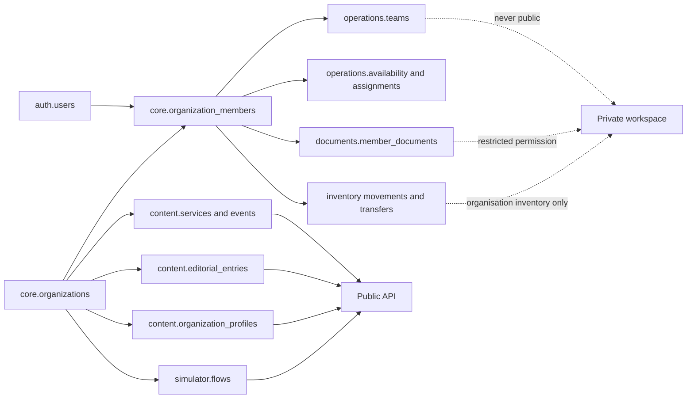

# Calais Info — PostgreSQL and Drizzle Schema Proposal

> This is a derived technical proposal. `PRODUCT.md` is authoritative for product scope, requirements, and data boundaries.

## Status

This document proposes the application schema for Phases 1–4. It is intended to become the source for Drizzle table definitions and migrations, but it is not yet a migration.

The proposal covers:

- Authentication, sessions, account recovery, invitations, and terms acceptance.
- Verified organisations, public profiles, roles, and organisation membership.
- Places, audience-labelled public services, provider organisations, schedules, closures, searchable needs, and public events.
- Articles, images/video, AI-translation provenance, custody transfer, revisions, and multi-organisation approval projections.
- The anonymous information simulator and its versioned decision graph.
- Files, PDFs, audio, video, contacts, and controlled taxonomies.
- Global and organisation-scoped tags with translations, color, and display order.
- Members, teams, skills, languages, driving permits, training/courses, availability, agenda imports, missions, and assignments.
- Restricted volunteer/internship documents and signatures.
- Movement-ledger inventory, storage locations, items/lots, kits, reservations, transfers, distributions, and alerts.
- Notifications, audit events, and tenant isolation.

Assistance or beneficiary records are intentionally absent. If introduced later, they should use a separate database or service with different database credentials, authorization rules, retention, logging, and governance.

## 1. Recommended PostgreSQL Schemas

Use PostgreSQL schemas as domain boundaries while keeping one Drizzle project:

| PostgreSQL schema | Responsibility                                                                                | Public access                                 |
| ----------------- | --------------------------------------------------------------------------------------------- | --------------------------------------------- |
| `auth`            | Login identities, linked providers, sessions, verification, recovery                          | No                                            |
| `core`            | Organisations, membership, invitations, roles, languages, terms                               | No                                            |
| `content`         | Public profiles, places, services, events, editorial information, files                       | Published records only through the public API |
| `simulator`       | Versioned anonymous information-decision graphs                                               | Published versions only                       |
| `operations`      | Members, teams, availability, absences, planning, assignments                                 | No                                            |
| `documents`       | Restricted templates, files, signers, signature evidence                                      | No                                            |
| `inventory`       | Locations, item catalogue, movements, reservations, kits, transfers, alerts, restricted costs | No                                            |
| `notifications`   | Preferences, in-app notifications, delivery attempts, outbox                                  | No                                            |
| `audit`           | Append-only administrative, publishing, and restricted-access history                         | No                                            |



## 2. Global Conventions

### Identifiers and names

- Use UUID primary keys with `uuid(...).defaultRandom()`.
- Use snake_case in PostgreSQL and camelCase properties in TypeScript.
- Use `organization_id` on every organisation-owned record, even when it could be derived through another relation.
- Add a unique constraint on `(organization_id, id)` for tenant-owned parent tables.
- Use composite foreign keys such as `(organization_id, member_id)` so the database rejects cross-organisation relationships.
- Do not encode personal information in identifiers.

### Time

- Use `timestamptz` for moments such as publication, event occurrences, invitations, signatures, and audit events.
- Store the organisation or series IANA timezone, normally `Europe/Paris`, for recurring local schedules.
- Use `date` and local `time` for weekly service hours and recurring availability rules.
- Store generated event occurrences as `timestamptz` so daylight-saving changes are resolved before public display.

### Record lifecycle

- Prefer explicit statuses over `deleted_at` when a business lifecycle exists.
- Use `archived_at` for recoverable content removal.
- Never hard-delete published revision history, completed signatures, or required audit evidence from ordinary application code.
- Cascade only disposable join rows. Use `restrict` for published content, signed documents, and audit-referenced records.

### Translations

- Keep translatable text in translation tables with a `language_code` foreign key.
- Do not store translations as a single JSON object; per-language rows need independent review, fallback, and publication states.
- Translation uniqueness is normally `(parent_id, language_code)` or `(revision_id, language_code)`.
- Store whether a translation is `draft`, `machine_generated`, `needs_review`, `verified`, or `rejected`, plus source language and `human`/`ai`/`ai_then_human_review` provenance.

### Publication and revisions

- Separate the stable record identity from immutable revisions.
- A published-locale row points to the exact revision currently public for that language.
- Updating published content creates a new revision; it never overwrites the previous revision.
- Services, places, schedules, and events may be edited as typed rows, but every publication creates an immutable public snapshot for audit and rollback.
- A joint publication is sealed as one immutable approval bundle covering its exact snapshots, media, sources, freshness data, and proposed public organisations. Approval never carries to a changed bundle hash.

### Flexible and stable values

- PostgreSQL enums are appropriate for stable state machines such as invitation, publication, assignment, and signature status.
- Permission codes, speciality taxonomies, service categories, and document types should be rows, not enums. They will evolve without requiring enum migrations.
- Use `jsonb` only for bounded provider payloads, structured editor documents, audit metadata, and immutable public snapshots—not as a replacement for the relational model.

### Designing for expansion

The schema is designed to evolve through additive migrations, not to predict every future feature. Future expansion is supported by:

- Global users separated from organisation membership, allowing the same person to work with several organisations concurrently or sequentially.
- Stable membership identities separated from engagement periods, allowing a volunteer to leave, return, or later become staff without destroying history.
- Taxonomies, member types, permissions, document types, tags, skills, and languages stored as rows rather than hard-coded application enums.
- Typed many-to-many join tables, which allow additional associations without duplicating entity columns.
- Stable content identities with immutable revisions and per-language publication pointers.
- Revision-specific publication parties and approval bundles, allowing one or many organisations without adding `organization_2_id`-style columns.
- Private operational events separated from public events, with an explicit optional link.
- Provider-neutral authentication and signature metadata around provider-specific IDs/payloads.
- An append-only stock ledger and typed inventory joins, allowing new locations, item tracking policies, and movement types without rewriting balances.
- `jsonb` reserved for bounded extension points while important queryable fields stay relational.

“Future-proof” does not mean schema-free. New business concepts should normally receive an additive table/migration instead of being forced into a generic entity/value table.

## 3. Shared Drizzle Foundation

```ts
import { sql } from "drizzle-orm";
import {
  boolean,
  check,
  date,
  foreignKey,
  index,
  integer,
  jsonb,
  numeric,
  pgSchema,
  primaryKey,
  text,
  time,
  timestamp,
  unique,
  uuid,
} from "drizzle-orm/pg-core";

export const auth = pgSchema("auth");
export const core = pgSchema("core");
export const content = pgSchema("content");
export const simulator = pgSchema("simulator");
export const operations = pgSchema("operations");
export const documents = pgSchema("documents");
export const inventory = pgSchema("inventory");
export const notifications = pgSchema("notifications");
export const audit = pgSchema("audit");

export const timestamps = {
  createdAt: timestamp("created_at", { withTimezone: true })
    .notNull()
    .defaultNow(),
  updatedAt: timestamp("updated_at", { withTimezone: true })
    .notNull()
    .defaultNow(),
};
```

`updated_at` must be set by the application or a PostgreSQL trigger; `defaultNow()` only supplies the inserted value.

## 4. Authentication and Accounts

Authentication library choice may rename these tables, but the data boundaries should remain the same. Do not put organisation roles directly on `auth.users` because one account can belong to several organisations with different permissions.

### `auth.users`

Global login identity.

| Column                     | Type                   | Notes                       |
| -------------------------- | ---------------------- | --------------------------- |
| `id`                       | `uuid PK`              | Random identifier           |
| `display_name`             | `text nullable`        | Account-level display only  |
| `preferred_language_code`  | `text FK nullable`     | UI preference               |
| `disabled_at`              | `timestamptz nullable` | Platform account suspension |
| `last_login_at`            | `timestamptz nullable` | Security metadata           |
| `created_at`, `updated_at` | `timestamptz`          | Standard timestamps         |

### `auth.user_emails`

A user may keep a personal email and add one or more organisation emails without creating a second identity.

| Column                     | Type                   | Notes                                               |
| -------------------------- | ---------------------- | --------------------------------------------------- |
| `id`                       | `uuid PK`              | Email record ID                                     |
| `user_id`                  | `uuid FK`              | Owning global user                                  |
| `email`                    | `text`                 | Original display form                               |
| `normalized_email`         | `text`                 | Trimmed and lower-cased for lookup; globally unique |
| `is_primary`               | `boolean`              | One primary email per user                          |
| `verified_at`              | `timestamptz nullable` | Authentication verification                         |
| `created_at`, `updated_at` | `timestamptz`          | Standard timestamps                                 |

The global uniqueness of `normalized_email` prevents two login identities from claiming the same verified address. It does **not** limit a user to one organisation. Organisation relationships are stored in `core.organization_members`, and an organisation-specific contact address may also be stored on that membership.

### Authentication support tables

| Table                           | Purpose                                             | Important columns/constraints                                                                                                                        |
| ------------------------------- | --------------------------------------------------- | ---------------------------------------------------------------------------------------------------------------------------------------------------- |
| `auth.accounts`                 | Password or external identity-provider linkage      | `user_id`, optional `user_email_id`, `provider`, `provider_account_id`, optional `password_hash`; unique provider identity                           |
| `auth.sessions`                 | Revocable login sessions                            | hashed `session_token`, `user_id`, `expires_at`, `last_seen_at`, nullable `second_factor_verified_at`; never store raw tokens                        |
| `auth.verification_tokens`      | Email verification and passwordless login           | hashed token, purpose, email/user, expiry, consumed time                                                                                             |
| `auth.second_factor_challenges` | Short-lived SMS verification for a specific session | user, hashed session token, keyed code digest, locale, delivery state, bounded attempts, expiry, consumed time; never store the phone number or code |
| `auth.password_reset_tokens`    | Single-use password recovery                        | hashed token, user, expiry, consumed time                                                                                                            |
| `auth.authenticators`           | Optional WebAuthn/passkey credentials               | credential ID, public key, counter, transports                                                                                                       |
| `auth.recovery_codes`           | Optional MFA recovery                               | one-way hash, user, consumed time                                                                                                                    |

Security events such as login failure, recovery, session revocation, MFA changes, and account disablement also create `audit.events` rows. IP addresses and user-agent retention require an explicit policy.

Slice 0 has a fixed invited-editor allowlist. Its email-to-phone mapping is deployment configuration rather than account data: there is no public enrolment, phone-number editing, or recovery flow. A successful magic-link login still requires a session-bound, single-use SMS challenge before any private read or mutation is allowed.

## 5. Organisations, Invitations, and Authorization

### Organisation tables

| Table                             | Purpose                                                                   | Important columns                                                                                 |
| --------------------------------- | ------------------------------------------------------------------------- | ------------------------------------------------------------------------------------------------- |
| `core.organizations`              | Stable private organisation identity                                      | `id`, `slug`, legal/display name, timezone, status, publishing suspension                         |
| `core.organization_verifications` | Platform verification and duplicate/impersonation review                  | organisation, reviewer, method, status, notes, evidence asset, decision times                     |
| `core.organization_members`       | Stable person/account identity inside one organisation                    | organisation, nullable user, operational name/contact, status, first/last seen times              |
| `core.member_types`               | Extensible participation type catalogue                                   | code such as staff/volunteer/intern, label key, active state, display order                       |
| `core.member_engagements`         | Historical period and type of participation                               | organisation, member, member type, start/end dates, status, ended reason                          |
| `core.invitations`                | Phase 1 publisher, Phase 2 admin/editor, and Phase 3 member invitations   | organisation, email/phone, invitation kind, hashed token, inviter, expiry, accepted/revoked times |
| `core.invitation_roles`           | Roles that will be granted on acceptance                                  | invitation, role                                                                                  |
| `core.legal_documents`            | Versioned privacy notice, platform terms, and publishing responsibilities | kind, version, language, asset/content, effective date                                            |
| `core.legal_acceptances`          | Evidence that a user accepted a specific version                          | user, organisation nullable, legal document, accepted time, evidence metadata                     |

`core.organization_members.user_id` stays nullable until an invited person creates or links an account. One `auth.users` row may be referenced by memberships in any number of organisations. Offboarding deactivates only that organisation relationship and its permissions; it does not delete the global account, affect another organisation, move content custody, or rewrite authored audit history.

`core.member_engagements` preserves changes over time. For example, one membership can have a volunteer engagement, an ended period, and a later staff engagement without rewriting history. A partial unique index may limit a member to one active engagement if pilot policy requires it; the model can also permit overlapping engagement types later.

### Role and permission tables

| Table                          | Purpose                                       | Key                                                                       |
| ------------------------------ | --------------------------------------------- | ------------------------------------------------------------------------- |
| `core.roles`                   | Platform-defined or organisation-defined role | `id`; nullable `organization_id` means platform template                  |
| `core.permissions`             | Extensible permission catalogue               | text `code PK`, description, sensitivity level                            |
| `core.role_permissions`        | Permission grant to role                      | `(role_id, permission_code)`                                              |
| `core.member_roles`            | Role assignment inside one organisation       | `(organization_id, member_id, role_id)` plus grant/review/expiry metadata |
| `core.permission_reviews`      | Periodic review campaign                      | organisation, due date, state, reviewer                                   |
| `core.permission_review_items` | Decision for one assignment                   | review, member role, keep/revoke, decision metadata                       |

Example permission codes:

```text
content.article.create       content.article.publish
content.joint_publication.approve
content.article_custody.transfer
content.service.manage      content.simulator.review
organization.profile.manage
members.read                members.manage
teams.manage                planning.manage
coordination.event.manage
documents.prepare           documents.send
documents.read_all          documents.audit
inventory.read              inventory.move
inventory.transfer.approve  inventory.financial.read
audit.read
```

## 6. Languages, Taxonomies, and Public Organisation Profiles

### Shared catalogue tables

| Table                                    | Purpose                                                                                                                                                                                               |
| ---------------------------------------- | ----------------------------------------------------------------------------------------------------------------------------------------------------------------------------------------------------- |
| `core.languages`                         | BCP 47 code, native name, English/French name, direction, enabled state, fallback code, public sort order                                                                                             |
| `core.cities`                            | City/territory catalogue: code, name translations, timezone, map bounds, ordered public areas (used by the simulator location question), active state                                                 |
| `content.service_categories`             | Stable service category code, icon, public color token, enabled state                                                                                                                                 |
| `content.service_category_translations`  | Category label and description by language                                                                                                                                                            |
| `content.service_features`               | Controlled amenity or intervention code, icon, enabled state, and default display order; examples include laundry, shower, charging, social assistance, drinking water, welcome kit, and nursing care |
| `content.service_feature_translations`   | Public feature label and description by language                                                                                                                                                      |
| `content.audience_categories`            | Controlled audience code (`all_public`, `women_only`, `children_only`, `under_18_only`, `families_only`, `adult_men_only`), icon/token, enabled state, display order                                  |
| `content.audience_category_translations` | Audience label and explanation by language; providers still supply record-specific eligibility detail                                                                                                 |
| `content.specialities`                   | Controlled association-speciality code and icon                                                                                                                                                       |
| `content.speciality_translations`        | Speciality label and description by language                                                                                                                                                          |
| `content.search_concepts`                | Stable need/topic concept such as breakfast, shoes, tents, water, or device charging, with optional mapped service category                                                                           |
| `content.search_concept_translations`    | Preferred search label by language                                                                                                                                                                    |
| `content.search_concept_aliases`         | Language-specific normalized synonyms, common spellings, and typo aliases for autocomplete                                                                                                            |
| `content.service_search_concepts`        | Verified need concepts satisfied by a service                                                                                                                                                         | `(service_id, search_concept_id)`, verified by/at |

### Flexible tags

Tags supplement controlled categories and specialities. They must not replace permissions, lifecycle statuses, or verified service/speciality taxonomies.

| Table                            | Purpose                                                | Important columns                                                                                             |
| -------------------------------- | ------------------------------------------------------ | ------------------------------------------------------------------------------------------------------------- |
| `core.tags`                      | Global or organisation-scoped tag                      | nullable organisation, namespace, code, color, display order, visibility (`public`/`workspace`), active state |
| `core.tag_translations`          | Localized tag label and optional description           | tag, language, label, description                                                                             |
| `content.organization_tags`      | Tag assigned to a public organisation profile          | organisation/profile, tag, optional display-order override                                                    |
| `content.service_tags`           | Tag assigned to a public service                       | service, tag, optional display-order override                                                                 |
| `content.public_event_tags`      | Tag assigned to a public event                         | event, tag, optional display-order override                                                                   |
| `content.editorial_entry_tags`   | Tag assigned to an article/fixed/basic entry           | entry, tag, optional display-order override                                                                   |
| `content.asset_tags`             | Tag assigned to a download/media record                | asset, tag, optional display-order override                                                                   |
| `operations.member_tags`         | Workspace-only member tag when operationally justified | organisation, member, tag                                                                                     |
| `operations.team_tags`           | Workspace-only team tag                                | organisation, team, tag                                                                                       |
| `operations.calendar_event_tags` | Workspace-only shift/mission/meeting tag               | organisation, event, tag                                                                                      |

Recommended `core.tags` behavior:

- `organization_id = null` means a platform-managed global tag; a value means the tag belongs to that organisation.
- `namespace` groups expandable uses such as `topic`, `audience`, `programme`, or `operational` without creating one ambiguous flat list.
- `color` stores an approved semantic token or validated color value. Text labels remain mandatory; color is never the only meaning.
- `display_order` supplies the default order. A typed assignment may override it for one screen/context.
- Uniqueness is `(organization_id, namespace, code)`, treating null organisation IDs as equal for global tags.
- Deactivation preserves assignments/history while hiding the tag from new selection.
- Typed join tables preserve real foreign keys. Avoid one polymorphic `tag_assignments(entity_type, entity_id)` table.

### Public association profile

| Table                                       | Purpose                                                     | Important columns                                                                                                                                       |
| ------------------------------------------- | ----------------------------------------------------------- | ------------------------------------------------------------------------------------------------------------------------------------------------------- |
| `content.organization_profiles`             | Public, reviewable part of an organisation                  | organisation, logo asset, website, visibility, last verified, review due, active publication snapshot                                                   |
| `content.organization_profile_translations` | Public purpose/summary by language                          | profile, language, purpose, accessibility summary, translation state                                                                                    |
| `content.organization_search_aliases`       | Verified former/common names used by autocomplete           | organisation, language, alias, normalized alias, active state, verified by/at                                                                           |
| `content.organization_specialities`         | Effective-dated speciality assignment/history               | organisation, speciality, state (`requested`, `verified`, `rejected`, `retired`), `is_primary`, display order, requested/verified/retired by/at, reason |
| `content.speciality_change_requests`        | One admin-submitted change set                              | organisation, requester, state, submitted/decided times, reviewer, reason                                                                               |
| `content.speciality_change_items`           | Add, remove, reorder, or set-primary action in a change set | request, speciality, action, proposed primary/order, decision/reason                                                                                    |
| `content.organization_languages`            | Languages in which service can actually be provided         | organisation, language, proficiency/scope, verified at                                                                                                  |
| `content.contacts`                          | Safe public or restricted contact method                    | organisation, type, value, visibility, purpose, active hours                                                                                            |
| `content.contact_translations`              | Contact label and instructions                              | contact, language, label, instructions                                                                                                                  |

An organisation can have many specialities. Enforce no more than one effective verified assignment with `is_primary = true` through a partial unique index. Marking a primary is optional: an organisation providing several services with equal weight (water and food, showers and laundry, mental and physical care) marks none, and the public card renders its specialities co-equally. Admins can retire a public assignment without deleting history. Additions and changed claims remain non-public until a platform reviewer verifies them. The Phase 1 product currently displays up to four secondary specialities, but that is a configurable publication/UI rule, not a storage limit or database trigger.

## 7. Places, Services, Schedules, and Public Events

### Places and service delivery

| Table                                             | Purpose                                                                      | Important columns                                                                                                                       |
| ------------------------------------------------- | ---------------------------------------------------------------------------- | --------------------------------------------------------------------------------------------------------------------------------------- |
| `content.places`                                  | A public or internal physical place                                          | organisation, address fields, PostGIS point, visibility, accessibility flags, directions metadata                                       |
| `content.place_translations`                      | Name, directions, landmark, accessibility text                               | place, language, translation state                                                                                                      |
| `content.services`                                | Stable service identity, usually at a place                                  | coordinating organisation, place, category, public status, contact, last verified, review due, archive state                            |
| `content.service_providers`                       | One or more verified associations that provide the service                   | service, organisation, provider role, display order, effective dates; at least one active provider before publication                   |
| `content.service_translations`                    | Public name, short description, instructions, uncertainty/cancellation copy  | service, language, translation state                                                                                                    |
| `content.service_feature_assignments`             | A verified feature available within one service offering                     | service, feature, availability mode (`available`, `scheduled`, `on_request`, `limited`), display order, effective dates, verified by/at |
| `content.service_feature_assignment_translations` | Offering-specific feature detail or condition                                | assignment, language, short detail, translation state                                                                                   |
| `content.service_audience_policies`               | Required launch audience classification and exact age bounds when applicable | service PK/FK, audience category, nullable minimum/maximum age, verified by/at                                                          |
| `content.service_audience_translations`           | Provider-supplied eligibility explanation                                    | audience policy, language, plain-language details, translation state                                                                    |
| `content.service_languages`                       | Languages available for this service                                         | service, language, verification metadata                                                                                                |
| `content.service_accessibility_features`          | Controlled accessibility feature assignment                                  | service/place, feature code, verification metadata                                                                                      |

Every place references a `core.cities` row. Activating a city automatically surfaces it in public city filters and as a simulator city question — territory expansion is a data change, not a schema or code change.

Treat `content.services` as visitor-facing offerings, not as organisation-wide capability rows. An organisation can own many service records at one place. Each record keeps its own schedule, audience, status, contact, and feature assignments. Organisation specialities summarize the organisation for directory discovery; they do not create feature assignments. The application must not union features across an organisation or copy them to another service.

Example: one MFS day-centre service can assign laundry, shower, charging, social assistance, mental-health support, food, drinking water, and welcome-kit features. A separate MFS nurse-led health service can assign nursing care, dressing changes, basic pain-relief support, and treatment of minor health issues. Both records require provider verification before publication and remain independent even when they share a provider or place.

Use PostGIS `geography(Point, 4326)` with a GiST index for distance queries. If PostGIS is deliberately deferred, use validated latitude/longitude numeric columns and accept that radius search will be less capable.

### Recurring service availability

| Table                                 | Purpose                                                    | Important columns                                                                          |
| ------------------------------------- | ---------------------------------------------------------- | ------------------------------------------------------------------------------------------ |
| `content.service_schedule_rules`      | Weekly recurring service hours                             | service, weekday, local start/end time, timezone, effective dates, public-holiday behavior |
| `content.service_schedule_exceptions` | Closure, cancellation, exceptional opening, or uncertainty | service, affected date/time, state, public reason, created by                              |
| `content.service_status_history`      | Trace important manual status changes                      | service, old/new state, effective interval, actor, reason                                  |

Schedule checks enforce `start_time < end_time` unless an explicit `ends_next_day` flag is true. French public-holiday behavior is stored on the rule, not inferred from UI copy.

### Public events

Public events remain separate from private shifts and missions. Linking them must never expose assigned member names or availability.

| Table                                        | Purpose                                                  | Important columns                                                                                                   |
| -------------------------------------------- | -------------------------------------------------------- | ------------------------------------------------------------------------------------------------------------------- |
| `content.public_events`                      | Stable public event/temporary distribution identity      | coordinating organisation, place, category, status, recurrence series, last verified, review due                    |
| `content.public_event_providers`             | One or more verified associations that provide the event | event, organisation, provider role, display order, effective dates; at least one active provider before publication |
| `content.public_event_audience_policies`     | Required launch audience classification and age bounds   | event PK/FK, audience category, nullable minimum/maximum age, verified by/at                                        |
| `content.public_event_audience_translations` | Provider-supplied event eligibility explanation          | audience policy, language, plain-language details, translation state                                                |
| `content.public_event_translations`          | Name, description, instructions, cancellation reason     | event, language, translation state                                                                                  |
| `content.public_event_series`                | Recurrence definition                                    | event, timezone, local start, duration, RRULE or controlled recurrence fields, effective dates                      |
| `content.public_event_occurrences`           | Materialized concrete occurrences                        | event, starts/ends at, state, exception source; unique event/start                                                  |
| `content.public_event_services`              | Services available during the event                      | `(event_id, service_id)`                                                                                            |

Materialize a rolling occurrence window, for example the next six months, whenever a series or exception changes. Public `open now` and calendar queries should not have to interpret every recurrence rule at request time.

The publishing transaction rejects a service/event with no effective verified provider or no audience policy. Public snapshots include each approved provider's organisation name and logo asset; the UI pairs every logo with the text name. The six launch audience codes remain catalogue rows, so later policy can add categories without altering service/event tables. `children_only` and `under_18_only` stay separate codes and rely on provider-approved translated details and explicit age bounds rather than application inference.

## 8. Articles, Fixed Information, and Basic Information

These three products share revision, translation, source, freshness, and publication behavior, so use one editorial base with typed detail tables.

### Stable entry and immutable revisions

| Table                                         | Purpose                                                            | Important columns                                                                                                                                             |
| --------------------------------------------- | ------------------------------------------------------------------ | ------------------------------------------------------------------------------------------------------------------------------------------------------------- |
| `content.editorial_entries`                   | Stable identity and URL                                            | kind (`article`, `fixed_information`, `basic_information`), slug, workflow state, archived time; custody and public attribution use separate tables           |
| `content.editorial_revisions`                 | Immutable authored revision                                        | entry, revision number, author, structured body schema version, can become outdated, unreliable from, last reviewed, review due, source summary, created time |
| `content.editorial_revision_translations`     | Localized content for one revision                                 | revision, language, title, summary, structured body JSON, plain-text fallback, translation state, verified by/at                                              |
| `content.editorial_publications`              | Typed pointer to the exact revision/snapshot public for one locale | entry, language, revision, publication snapshot, approval bundle nullable, published by/at, unpublished at; one active publication per entry/language         |
| `content.article_details`                     | Article-only metadata                                              | entry PK/FK, article date, featured state                                                                                                                     |
| `content.fixed_information_details`           | Fixed-information metadata                                         | entry PK/FK, topic code, review interval days                                                                                                                 |
| `content.basic_information_details`           | Basic-information tile metadata                                    | entry PK/FK, icon, priority, matching service-category filter, emergency flag                                                                                 |
| `content.editorial_custodianships`            | Effective-dated administrative control of an entry                 | entry, custodian kind (`organization`/`platform`), nullable organisation, started/ended times, accepted by; one active row                                    |
| `content.editorial_custody_transfer_requests` | Admin-only proposed custody change                                 | entry, source custodian, destination kind/organisation, initiator, state, token hash, expiry, accepted/declined/cancelled times and actors                    |
| `content.editorial_custody_transfer_events`   | Append-only transfer history and notes                             | transfer request, actor, event type, safe note, time                                                                                                          |

`structured_body` may use a versioned editor JSON format, but it must be validated and rendered through an allowlist. Keep `plain_text_fallback` for low-bandwidth rendering and search.

### Sources, approvals, relationships, and review

| Table                                      | Purpose                                                                 | Important columns                                                                                                                      |
| ------------------------------------------ | ----------------------------------------------------------------------- | -------------------------------------------------------------------------------------------------------------------------------------- |
| `content.sources`                          | Traceable factual source                                                | title, publisher, URL/reference, source/retrieval dates, owner                                                                         |
| `content.editorial_revision_sources`       | Sources supporting a revision                                           | revision, source, role, display order                                                                                                  |
| `content.editorial_revision_organizations` | Organisations named in or responsible for the authored revision         | revision, organisation, relationship role; public attribution is separately sealed in the approval bundle                              |
| `content.review_tasks`                     | Review/freshness queue                                                  | entity/revision, assignee, due date, status, resolution                                                                                |
| `content.editorial_related_entries`        | Editorial relationships                                                 | source entry, related entry, relation kind                                                                                             |
| `content.editorial_related_services`       | Related service links                                                   | entry, service, relation kind, display order                                                                                           |
| `content.editorial_related_organizations`  | Related association links                                               | entry, organisation, relation kind, display order                                                                                      |
| `content.editorial_revision_assets`        | Download/media embedded or attached to an exact authored revision       | revision, asset, role, language, display order, optional structured block key                                                          |
| `content.translation_jobs`                 | Provider-neutral AI translation request/provenance                      | entity kind/ID, source/target language, source revision/hash, method, provider/model/job ID, state, requester, created/completed times |
| `content.translation_provenance`           | Public notice and review provenance attached to a typed translation row | translation job, translated entity kind/ID, method, AI-used flag, reviewer, verified time                                              |

The public outdated warning is derived from the published revision's `unreliable_from`; it should not be stored as manually edited display text. Public translation views derive a localized “translated from X to Y using AI” notice from `translation_provenance` whenever `ai_used = true`, including after human verification.

Custody transfer does not update historical revision organisations or publication parties. A transaction locks the entry, validates source-admin/platform-admin authority and destination acceptance, ends the old custodianship, and inserts the new row. Moving a user between organisation memberships does not call this workflow.

## 9. Files, PDFs, Audio, and Video

Binary files belong in private/public object storage, not PostgreSQL.

| Table                           | Purpose                                                                                 | Important columns                                                                                                                                                                 |
| ------------------------------- | --------------------------------------------------------------------------------------- | --------------------------------------------------------------------------------------------------------------------------------------------------------------------------------- |
| `content.assets`                | Stable uploaded file identity                                                           | uploader, organisation nullable, content language nullable, storage key, MIME type, byte size, duration, SHA-256, media kind, visibility, malware-scan state, rights confirmation |
| `content.asset_variants`        | Thumbnail, optimized image, printable PDF, audio/video rendition                        | parent asset, variant kind, storage key, MIME type, dimensions/duration, hash                                                                                                     |
| `content.asset_translations`    | Public title, description, alt text/equivalent description, transcript/caption metadata | asset, language, translation state                                                                                                                                                |
| `content.asset_text_tracks`     | Reviewed transcript, captions, subtitles, or equivalent description                     | asset, language, track kind, text/storage key, review state, verified by/at                                                                                                       |
| `content.downloads`             | Public downloadable-file record                                                         | asset, owner organisation, freshness/review metadata, status                                                                                                                      |
| `content.download_translations` | Public download title and description                                                   | download, language, translation state                                                                                                                                             |

Article media roles include `cover_image`, `inline_image`, `gallery_image`, `video`, `video_poster`, `audio`, and `attachment`. Images require localized alt text or an explicit decorative role. Video publication requires a poster/thumbnail, caption or transcript policy, rights confirmation, processing success, and a low-bandwidth representation.

Storage keys must be opaque. Signed document storage uses the separate `documents` schema and private bucket; it must never reuse a public asset URL.

## 10. Information Simulator

The simulator is an immutable, versioned directed graph. Draft editing happens on a new version; publishing never mutates the graph currently in use.

### Flow and version tables

| Table                           | Purpose                                              | Important columns                                                                                          |
| ------------------------------- | ---------------------------------------------------- | ---------------------------------------------------------------------------------------------------------- |
| `simulator.flows`               | Stable simulator identity                            | slug, owner organisation nullable, title key, status, archived time                                        |
| `simulator.flow_versions`       | Immutable version envelope                           | flow, version number, entry node, owner, source summary, last reviewed, review due, status, published time |
| `simulator.nodes`               | Question, information, or result node                | version, stable node key, node kind, optional/help flags, owner, review metadata                           |
| `simulator.node_translations`   | Prompt, explanation, result heading/body, disclaimer | node, language, translation state                                                                          |
| `simulator.options`             | Selectable answer for a question                     | node, stable option key, sort order, prefer-not-to-say flag                                                |
| `simulator.option_translations` | Answer label/help by language                        | option, language, translation state                                                                        |
| `simulator.edges`               | Allowed transition in the graph                      | version, from node, optional option, to node, priority; unique transition                                  |

### Reviewed result composition

| Table                                | Purpose                                                    |
| ------------------------------------ | ---------------------------------------------------------- |
| `simulator.node_sources`             | Traceable sources for each question/rule/result            |
| `simulator.result_editorial_entries` | Reviewed article/fixed/basic information shown by a result |
| `simulator.result_services`          | Matching public services shown by a result                 |
| `simulator.result_organizations`     | Relevant association profiles                              |
| `simulator.result_contacts`          | Safe next-step contacts                                    |
| `simulator.version_publications`     | Active published simulator version and locale readiness    |

There is intentionally no `simulator_answers`, `simulator_sessions`, or `simulator_people` table. Answers stay in browser memory/session storage and are discarded on restart or session end. Aggregate product analytics must not include answer values or a reconstructable result path.

Before publishing, validate that:

- The entry node exists in the same version.
- Every option has a valid next edge unless it intentionally terminates.
- Every reachable result has reviewed content and a disclaimer.
- No edge crosses into another flow version.
- Required translations or explicit fallback states exist.

## 11. Publishing Snapshots and Moderation

Places, services, events, profiles, and downloads are typed mutable records. Editorial records already have typed revisions. An `organization_id` on a typed record identifies its coordinating tenant/data custodian; it does not cap public attribution at one organisation. The following immutable publication layer makes every public representation attributable and reversible and supports approval by several organisations:

| Table                                    | Purpose                                                                                                          | Important columns                                                                                                                                                            |
| ---------------------------------------- | ---------------------------------------------------------------------------------------------------------------- | ---------------------------------------------------------------------------------------------------------------------------------------------------------------------------- |
| `content.publication_snapshots`          | Immutable exact public projection                                                                                | entity kind, entity ID, version, locale, source bundle, approved-party-set hash, payload JSON/hash, actor/system cause, created time                                         |
| `content.publication_approval_bundles`   | Immutable manifest submitted for organisation approval                                                           | entity kind/ID, optional typed editorial revision, manifest version, manifest hash, creator, sealed/superseded times                                                         |
| `content.publication_bundle_snapshots`   | Exact localized public views included in a bundle                                                                | bundle, snapshot, locale, display scope; unique bundle/snapshot                                                                                                              |
| `content.publication_bundle_assets`      | Exact audio, video, image, or file variants covered by approval                                                  | bundle, asset/variant, role, language, content hash                                                                                                                          |
| `content.publication_parties`            | Every organisation proposed for public attribution on that exact bundle                                          | bundle, organisation, attribution role code, display order; unique bundle/organisation/role                                                                                  |
| `content.publication_party_fragments`    | Structured logos, attribution rows, claims, and body/media block keys conditional on one organisation's approval | bundle, organisation, fragment kind/key, asset nullable, display order                                                                                                       |
| `content.publication_approval_requests`  | Secure email-linked review request for one organisation                                                          | bundle, organisation, authorised representative member, verified `auth.user_emails` record, token hash, state, sent/viewed/token-consumed/expiry/cancelled/invalidated times |
| `content.publication_approval_decisions` | Append-only approval or decline evidence                                                                         | request, bundle hash, organisation, representative/member, verified-email evidence, decision, decided at, safe evidence metadata                                             |
| `content.publication_approval_messages`  | Revision-linked discussion between requester and representative                                                  | request, author user/member, body, created time, optional supersedes message; notify participants through outbox                                                             |
| `content.publication_approval_events`    | Append-only request/reminder/view/decision lifecycle                                                             | request, actor, event type, safe metadata, time                                                                                                                              |
| `content.publication_snapshot_parties`   | Organisations visible in one immutable public projection                                                         | snapshot, organisation, attribution role, display order, approval decision                                                                                                   |
| `content.active_publications`            | Snapshot currently served                                                                                        | entity kind, entity ID, locale, snapshot, approval bundle nullable, published by/at                                                                                          |
| `content.moderation_cases`               | Duplicate, impersonation, conflict, unsafe content, suspension                                                   | organisation, entity reference, reason, status, assignee, resolution                                                                                                         |
| `content.moderation_events`              | Append-only case history                                                                                         | case, actor, action, reason, time                                                                                                                                            |

The bundle manifest is canonicalized before hashing. It includes the exact snapshot hashes, translation set, asset hashes, sources, freshness dates, claims, and ordered public attribution. A request stores only a hash of its single-use token. Email is the notification/identity-verification channel; the decision is recorded in the application after the representative reviews the complete manifest. The representative must be an active member of the requested organisation, the selected verified email must belong to that member's linked global user, and the member must hold the joint-publication approval permission at decision time.

Normal request transitions are `requested -> viewed -> changes_requested|approved|declined`; a representative/requester may exchange messages while the request remains active. `requested`, `viewed`, or `changes_requested` may become `expired`, `cancelled`, or `invalidated`. Terminal decisions, messages, and invalidation evidence remain append-only after the bundle is superseded.

The public projection contains only parties with a valid `approved` decision for the same sealed bundle hash. Pending, changes-requested, declined, expired, cancelled, unanswered, or invalidated parties and their `publication_party_fragments` stay out of the payload. A later approval regenerates an immutable snapshot with a new approved-party-set hash, inserts `publication_snapshot_parties`, and switches `active_publications` without creating an authored revision. The projection service rejects unstructured free text that names or claims participation by a party lacking approval; editors must bind that content to a conditional fragment or change the sealed revision.

Implement projection activation in one idempotent database transaction or transactional outbox consumer. It checks bundle immutability, snapshot hashes, visible-party/decision equality, organisation publishing status, provider/logo requirements, and permissions before writing `active_publications`. Initial publication requires at least one approved party. Every subsequent approval produces the same result if the worker retries.

The generic entity reference in publication/moderation tables is a deliberate exception because it spans several typed content tables. Application services must validate that the referenced typed entity exists. Editorial content and simulator graphs retain stronger typed revision foreign keys because their revision history is central to their behavior.

## 12. Team Members, Teams, Skills, and Languages

`core.organization_members` is the primary staff/volunteer/intern record. Operational profile extensions stay outside the login account.

| Table                                             | Purpose                                                     | Important columns                                                                                                                                                                         |
| ------------------------------------------------- | ----------------------------------------------------------- | ----------------------------------------------------------------------------------------------------------------------------------------------------------------------------------------- |
| `operations.member_profiles`                      | Restricted operational fields not required for login        | member PK/FK, preferred contact, profile-completion state, restricted accommodation pointer                                                                                               |
| `operations.teams`                                | Organisation team                                           | organisation, name, description, status                                                                                                                                                   |
| `operations.team_members`                         | Team membership and lead state                              | organisation, team, member, is lead, joined/left times                                                                                                                                    |
| `operations.skills`                               | Organisation or platform skill catalogue                    | nullable organisation, code, name, verification required                                                                                                                                  |
| `operations.member_skills`                        | Member skill/qualification                                  | organisation, member, skill, level, verification actor/time, expiry                                                                                                                       |
| `operations.member_languages`                     | Spoken operational language capability                      | organisation, member, language, proficiency, declaration/verification state, verified/expiry times                                                                                        |
| `operations.driving_permit_categories`            | Extensible permit category catalogue                        | jurisdiction, code, active state                                                                                                                                                          |
| `operations.driving_permit_category_translations` | Localized permit category label/help                        | category, language, label, description                                                                                                                                                    |
| `operations.member_driving_permits`               | Minimal driving qualification                               | organisation, member, category, state (`self_declared`, `awaiting_verification`, `verified`, `rejected`, `expired`, `declared_none`), expiry, verifier; no licence number/file by default |
| `operations.training_courses`                     | Organisation or platform training/course catalogue          | nullable organisation, provider, title key, URL, description, verification required, validity interval, active state                                                                      |
| `operations.training_course_translations`         | Localized course title/description                          | course, language, title, description                                                                                                                                                      |
| `operations.member_training_records`              | Member-declared/completed training                          | organisation, member, course, completion/expiry dates, declaration/verification state, verifier, optional restricted evidence reference                                                   |
| `operations.profile_field_policies`               | Purpose notice shown before collecting an operational field | organisation, field code, purpose text key, visibility/permission, required context, retention policy, evidence allowed, active state                                                     |

Emergency contacts, accommodation needs, and any approved driving/training evidence should use separate encrypted/restricted tables if a pilot establishes a justified need. They should not appear in an ordinary member-list query. APIs return a field policy with each editable qualification so the client can show purpose, audience, requirement status, and retention before save.

## 13. Availability, Absences, and Planning

Availability, absence, an assignment, and an event are different concepts and should not share one overloaded status column.

### Availability

| Table                                | Purpose                                  | Important columns                                                                                            |
| ------------------------------------ | ---------------------------------------- | ------------------------------------------------------------------------------------------------------------ |
| `operations.availability_rules`      | Recurring weekly availability/preference | organisation, member, weekday, local start/end, timezone, state, effective dates                             |
| `operations.availability_exceptions` | One-off override                         | organisation, member, starts/ends at, state, optional non-sensitive note                                     |
| `operations.absence_requests`        | Staff absence approval workflow          | organisation, member, interval, category code, status, reviewer, decision time; reason separately restricted |
| `operations.absence_reasons`         | Optional restricted detail               | absence request PK/FK, encrypted/provider-protected content, access classification                           |

Volunteer/intern unavailability should normally use availability exceptions, not an employee absence category.

### Private calendar and assignments

| Table                                      | Purpose                                                  | Important columns                                                                                                           |
| ------------------------------------------ | -------------------------------------------------------- | --------------------------------------------------------------------------------------------------------------------------- |
| `operations.calendar_events`               | Shift, mission, meeting, or training                     | organisation, optional team/place/public event, kind, title, start/end, recurrence, required capacity, status               |
| `operations.calendar_event_occurrences`    | Concrete occurrence of recurring private event           | calendar event, starts/ends at, state, unique series/start                                                                  |
| `operations.event_skill_requirements`      | Required/preferred skill and minimum count/level         | event or occurrence, skill, necessity, minimum level/count                                                                  |
| `operations.event_language_requirements`   | Required/preferred spoken language                       | event or occurrence, language, necessity, minimum proficiency/count                                                         |
| `operations.event_training_requirements`   | Required/preferred completed course                      | event or occurrence, course, necessity, verification/validity requirement, minimum count                                    |
| `operations.event_driving_requirements`    | Required/preferred driving qualification                 | event or occurrence, permit category, necessity, verified-valid requirement, minimum count                                  |
| `operations.event_assignments`             | Member invited/assigned to occurrence                    | organisation, occurrence, member, status, response time, coordinator note                                                   |
| `operations.assignment_requirement_checks` | Snapshot of requirement match/gap at proposal/acceptance | assignment, requirement kind/ID, result, checked at, override actor/reason nullable                                         |
| `operations.assignment_events`             | Append-only acceptance/change/cancellation history       | assignment, actor, old/new status, reason, time                                                                             |
| `operations.calendar_imports`              | One `.ics`/approved `.csv` import batch                  | organisation, source asset/hash, format, timezone, mapping JSON, state, creator, preview/commit/undo times, idempotency key |
| `operations.calendar_import_rows`          | Parsed row/component and validation result               | import, source row/UID/recurrence ID, normalized payload, state, error codes, created event/occurrence nullable             |
| `operations.calendar_import_events`        | Append-only preview/commit/undo history                  | import, actor, action, counts, safe metadata, time                                                                          |

`operations.calendar_events.public_event_id` may link a private operational event to a public event. The public API never joins through to assignments. A staffing change raises a publishing review task; it does not silently alter public information.

Required and preferred requirements use a stable necessity code. Assignment checks never treat a preferred gap as blocking. A required gap needs an authorised override with a reason, and the audit event records the requirement snapshot that the coordinator overrode.

Calendar import parses into staging rows first. Commit uses the file hash, organisation, source UID/recurrence ID, and idempotency key to prevent retry duplicates. Undo creates cancellation/reversal events only for unchanged records created by that batch; it does not hard-delete later edits or unrelated events.

### Inter-organisation coordination agenda

Introduced with Phase 2 workspaces: a narrow, deliberate cross-tenant surface (never public) for events such as a daily inter-association briefing.

| Table                                         | Purpose                                                                    | Important columns                                                                                                                                                   |
| --------------------------------------------- | -------------------------------------------------------------------------- | ------------------------------------------------------------------------------------------------------------------------------------------------------------------- |
| `operations.coordination_events`              | Organisation- or platform-hosted coordination event/meeting                | host organisation nullable (null = platform), city, visibility (`organisation`/`inter_organisation`), title, description, safe location/contact, status, created by |
| `operations.coordination_event_series`        | Recurrence for repeating events                                            | event, timezone, local start, duration, RRULE or controlled recurrence fields, effective dates                                                                      |
| `operations.coordination_event_occurrences`   | Materialized occurrences with change/cancellation state and visible reason | event, starts/ends at, state, reason, unique event/start                                                                                                            |
| `operations.coordination_event_participation` | Organisation-level participation state                                     | event or occurrence, organisation, state (`attending`/`interested`/`declined`), actor member, updated at                                                            |

RLS: `organisation` rows follow the standard tenant policy; `inter_organisation` rows are readable by any active member of a verified organisation through a dedicated policy or view — the same explicit-exception pattern as transfers and joint publication. Writing always requires the host organisation's coordination permission. Coordination events are excluded from every public read model.

Recommended weekly-board indexes:

- `calendar_event_occurrences (organization_id, starts_at, ends_at)`.
- `event_assignments (organization_id, member_id, occurrence_id)`.
- `availability_exceptions (organization_id, member_id, starts_at, ends_at)`.
- `absence_requests (organization_id, member_id, starts_at, ends_at, status)`.
- Team-member indexes in both team-to-member and member-to-team order.

## 14. Restricted Documents and Signatures

Document contents and signed files are not ordinary `content.assets`.

| Table                         | Purpose                                                       | Important columns                                                                                                       |
| ----------------------------- | ------------------------------------------------------------- | ----------------------------------------------------------------------------------------------------------------------- |
| `documents.document_types`    | Organisation-approved participation-document type             | code, name, retention rule, signature policy                                                                            |
| `documents.templates`         | Stable template identity                                      | organisation, document type, name, active state                                                                         |
| `documents.template_versions` | Locked approved template version                              | template, version, private storage key, hash, merge-field schema, approved by/at                                        |
| `documents.member_documents`  | Generated document workflow                                   | organisation, member, template version, status, expiry, sent/completed/cancelled times, created/reviewed by             |
| `documents.document_files`    | Draft, final, and evidence files                              | document, file purpose, private storage key, MIME, size, hash, created time                                             |
| `documents.signers`           | Internal or external signer and ordering                      | document, optional member, external name/contact, order, role, status, viewed/signed/declined times, provider signer ID |
| `documents.signature_events`  | Append-only provider and user workflow history                | document, signer nullable, event type, provider event ID, safe metadata, time                                           |
| `documents.access_grants`     | Exceptional per-document access                               | document, member/role, permission, granted by, expiry                                                                   |
| `documents.retention_actions` | Retention review, legal hold, deletion/anonymisation evidence | document, action, policy, actor, time                                                                                   |

Rules:

- Once sent, a document's template version, generated file hash, and signer list are immutable.
- A correction cancels the workflow and creates a new document.
- The final signed file and provider evidence are separate `document_files` rows with SHA-256 hashes.
- Notification payloads contain only a safe task reference, never the file or sensitive title/body.
- Team membership does not grant document access.
- Document read/download actions generate restricted access audit events.

## 15. Inventory Management

Inventory uses an append-only movement ledger. Never treat one mutable `quantity_on_hand` column as the source of truth.

### Catalogue, locations, lots, and identifiers

| Table                             | Purpose                                              | Important columns                                                                                            |
| --------------------------------- | ---------------------------------------------------- | ------------------------------------------------------------------------------------------------------------ |
| `inventory.locations`             | Organisation storage location                        | organisation, name, kind, optional place/address, responsible team, status, access-note classification       |
| `inventory.units`                 | Controlled unit catalogue                            | code, dimension, precision, translated label, active state                                                   |
| `inventory.categories`            | Organisation or platform item taxonomy               | nullable organisation, parent category, code, active state, display order                                    |
| `inventory.category_translations` | Category label by language                           | category, language, label, description                                                                       |
| `inventory.items`                 | Stable stock item identity                           | organisation, category, code, base unit, tracking policy, active state                                       |
| `inventory.item_translations`     | Item public/workspace name and description           | item, language, name, description                                                                            |
| `inventory.item_variants`         | Size, format, packaging, or other controlled variant | item, code, attributes, base-unit factor, active state                                                       |
| `inventory.item_identifiers`      | Barcode/QR/internal scan code                        | organisation, item/variant, identifier type/value, active dates; unique active value per organisation        |
| `inventory.lots`                  | Optional batch/lot/serial grouping                   | organisation, item/variant, lot code, expiry date, condition, source reference, status                       |
| `inventory.stock_policies`        | Per-location/item threshold and tracking policy      | organisation, location, item/variant, minimum/preferred quantity, expiry-warning days, negative-stock policy |

Use `numeric`, never floating point, for quantities and unit factors. Unit conversion must remain within the same dimension and use the item's configured base unit. A tracking policy decides whether a movement requires a lot, expiry date, condition, or serial; the schema does not force batch tracking on every item.

### Ledger, counts, and restricted value

| Table                         | Purpose                                  | Important columns                                                                                                                    |
| ----------------------------- | ---------------------------------------- | ------------------------------------------------------------------------------------------------------------------------------------ |
| `inventory.movement_headers`  | One posted business action               | organisation, movement type, status, reason, linked event/mission/import/transfer/kit, actor, occurred/posted times, idempotency key |
| `inventory.movement_lines`    | Signed stock delta                       | movement, location, item/variant, lot nullable, quantity delta in base unit, condition; no update/delete after posting               |
| `inventory.movement_events`   | Append-only post/reverse/correct history | movement, actor, event type, reason, safe metadata, time                                                                             |
| `inventory.financial_entries` | Separately protected item/movement value | organisation, movement/line, currency, unit cost, replacement value, source document, access class                                   |
| `inventory.stock_counts`      | Physical-count session                   | organisation, location, scope, state, opened/closed by/at                                                                            |
| `inventory.stock_count_lines` | Counted quantity and variance            | count, item/variant/lot, expected quantity snapshot, counted quantity, variance, adjustment movement nullable                        |

Balances come from a transactionally maintained projection/materialized table or view such as `inventory.stock_balances`, keyed by organisation/location/item/variant/lot/condition. The movement ledger remains authoritative. Corrections create compensating movements with a reason. Database permissions deny update/delete on posted lines to the application role.

### Reservations, kits, transfers, alerts, and imports

| Table                             | Purpose                                                                    | Important columns                                                                                                                         |
| --------------------------------- | -------------------------------------------------------------------------- | ----------------------------------------------------------------------------------------------------------------------------------------- |
| `inventory.reservations`          | Stock held for a public event, private mission, or kit batch               | organisation, target kind/ID, location, state, reserved/released/consumed times, creator                                                  |
| `inventory.reservation_lines`     | Reserved item quantity                                                     | reservation, item/variant/lot nullable, quantity, unit, fulfilled/released quantity                                                       |
| `inventory.kit_definitions`       | Stable kit identity                                                        | organisation, code, active state                                                                                                          |
| `inventory.kit_versions`          | Effective immutable bill of materials                                      | kit, version, effective dates, status, approved by/at                                                                                     |
| `inventory.kit_components`        | Item quantities/substitutions in a kit version                             | kit version, item/variant, quantity/unit, substitution group, required state                                                              |
| `inventory.transfer_requests`     | Internal or cross-organisation stock offer and logistics                   | source organisation/location, destination organisation/location nullable, kind, state, expiry, dispatch/receipt times, initiator/acceptor |
| `inventory.transfer_lines`        | Offered/dispatched/received item quantities                                | transfer, source item/variant/lot, destination item mapping nullable, offered/dispatched/received quantity, unit, discrepancy reason      |
| `inventory.transfer_events`       | Append-only offer/note/accept/decline/dispatch/receipt/discrepancy history | transfer, actor organisation/member, event type, safe note, time                                                                          |
| `inventory.transfer_ledger_links` | Tenant-local movements created by one transfer                             | transfer, organisation, movement; unique transfer/organisation/movement role                                                              |
| `inventory.alerts`                | Low/out-of-stock and expiry alert instance                                 | organisation, location, item/variant/lot, kind, threshold/current quantity, state, acknowledged/resolved by/at                            |
| `inventory.imports`               | CSV item/opening-balance import batch                                      | organisation, source file/hash, mapping, state, idempotency key, preview/commit/reversal times                                            |
| `inventory.import_rows`           | Validated staging row and result                                           | import, row number, normalized payload, state/errors, created entity/movement nullable                                                    |

Anonymous distributions use a `distribution` movement header linked to an optional event and aggregate movement lines. No inventory table contains a beneficiary/person foreign key. Cross-organisation transfers expose the request, lines, logistics, and notes to the two party organisations through explicit policies; they do not open either inventory workspace to the other party. Each side posts its own ledger movement and links it through `transfer_ledger_links`.

## 16. Notifications and Reliable Background Work

| Table                             | Purpose                                          | Important columns                                                                                    |
| --------------------------------- | ------------------------------------------------ | ---------------------------------------------------------------------------------------------------- |
| `notifications.preferences`       | Per-user/org/channel preferences                 | user, organisation nullable, notification kind, email/SMS/push/in-app enabled                        |
| `notifications.endpoints`         | Verified email, phone, or push endpoint          | user, channel, encrypted address/token, verified/disabled times                                      |
| `notifications.notifications`     | Safe in-app notification                         | recipient, organisation, kind, safe title/body key, entity reference, read time                      |
| `notifications.delivery_attempts` | Delivery lifecycle                               | notification, endpoint/channel, provider ID, status, attempt count, error code, sent/delivered times |
| `notifications.outbox`            | Transactional jobs emitted with database changes | event type, aggregate ID, payload, available time, processed time, attempt count                     |

Use an outbox worker for invitation emails, approval request notes/reminders, approval-projection regeneration, review reminders, schedule changes, cancellations, inventory alerts/transfers, and signing-provider synchronization. Approval/note emails contain an opaque expiring link and safe context, not the unpublished content or note body. Never send an external notification before the database transaction creating its state has committed.

## 17. Audit and Security Events

### `audit.events`

Append-only event table:

| Column            | Type                 | Notes                                                                                                      |
| ----------------- | -------------------- | ---------------------------------------------------------------------------------------------------------- |
| `id`              | `uuid PK`            | Random event ID                                                                                            |
| `organization_id` | `uuid nullable`      | Null for platform-wide events                                                                              |
| `actor_user_id`   | `uuid nullable`      | Human account                                                                                              |
| `actor_member_id` | `uuid nullable`      | Organisation membership used                                                                               |
| `actor_type`      | enum                 | user, system, provider, support                                                                            |
| `action`          | `text`               | Namespaced code such as `article.published`, `article.custody_transferred`, or `inventory.movement_posted` |
| `subject_type`    | `text`               | Safe entity type                                                                                           |
| `subject_id`      | `uuid/text nullable` | Safe entity identifier                                                                                     |
| `reason`          | `text nullable`      | Required for sensitive administrative actions                                                              |
| `metadata`        | `jsonb`              | Allowlisted safe metadata only                                                                             |
| `occurred_at`     | `timestamptz`        | Event time                                                                                                 |
| `request_id`      | `text nullable`      | Correlation without raw request data                                                                       |

Do not put passwords, tokens, simulator answers, signed-document content, assistance information, or unrestricted before/after objects in audit metadata.

For high-volume document access, optionally use `audit.restricted_access_events` with subject, permission decision, action, and time, then apply a separate retention policy.

## 18. Row-Level Security and Tenant Isolation

Enable PostgreSQL RLS on every organisation-owned private table. Set the active organisation and user inside a transaction:

```sql
select set_config('app.organization_id', :organization_id, true);
select set_config('app.user_id', :user_id, true);
```

Basic organisation policy:

```sql
using (
  organization_id =
  nullif(current_setting('app.organization_id', true), '')::uuid
)
with check (
  organization_id =
  nullif(current_setting('app.organization_id', true), '')::uuid
)
```

RLS is defense in depth, not the complete authorization system:

- Application permission checks decide what the current member may do.
- RLS prevents accidental cross-organisation access.
- Composite tenant foreign keys prevent cross-organisation relationships.
- Public requests use dedicated views or queries exposing published fields only.
- Background workers use narrow database roles and explicitly set tenant context.
- Migration/database-owner roles must not be reused by the application because owners can bypass ordinary RLS behavior.

Document tables need an additional policy or security-definer access function checking explicit document permissions; matching `organization_id` alone is insufficient.

Joint-publication review is also an explicit cross-organisation exception. A recipient organisation may read only the sealed bundle and approval request in which it is a party, through a narrow security-definer function or equivalent service check that validates the request token/session, representative membership, verified email, expiry, and approval permission. It does not grant access to the coordinating organisation's drafts, workspace, members, or other bundles.

Article-custody requests and cross-organisation inventory transfers use the same party-scoped principle. Each participant may read the shared request, permitted lines/logistics, notes, and events. The destination cannot read source drafts, unrelated articles, balances, costs, locations, suppliers, or members. Security-definer functions that accept, dispatch, or receive must recheck the active membership and specific permission for the acting organisation.

## 19. Public Read Model

Do not expose content authoring tables directly to the anonymous API. Create read-only views or materialized views such as:

```text
public_api.organization_profiles
public_api.service_search
public_api.service_occurrences
public_api.public_events
public_api.editorial_content
public_api.downloads
public_api.simulator_versions
```

These views include active publication snapshots, safe contacts, verified taxonomies, per-service feature assignments and translated labels/details, permitted translations, approved provider names/logos, audience labels/details, and organisations listed in `publication_snapshot_parties`. They exclude pending parties/fragments, approval-recipient identities, draft metadata, internal contacts, member identities, assignments, coordination events, inventory, audit notes, and document references.

For autocomplete, create a materialized `public_api.search_suggestions` read model with language, normalized term, display label, suggestion kind (`location`, `organization`, `need`, `service`, `service_feature`, `speciality`), target ID, subtitle, optional point/bounds, and rank. Build it from active place/address/landmark translations, approved organisation names/aliases, search concepts/aliases, service categories, service features, specialities, and active service snapshots. Use `unaccent`, `pg_trgm`, normalized prefix indexes, and language-aware `tsvector`/GIN indexes where supported. Return grouped kinds and stable target IDs; search remains a derived read model.

## 20. Key Constraints and Indexes

At minimum:

- Globally unique `auth.user_emails.normalized_email`; this protects account identity and does not constrain organisation membership.
- One primary email per user through a partial unique index.
- Unique organisation slug.
- Unique `(organization_id, user_id)` membership identity where `user_id` is not null; the same user ID may appear in other organisations.
- Engagement indexes on `(organization_id, member_id, started_at, ended_at)` and an optional one-active-engagement partial unique constraint.
- Unique taxonomy codes.
- Unique tag code within `(organization_id, namespace)`, with a separate/global null-safe uniqueness rule.
- Unique translation `(parent_id, language_code)`.
- Unique editorial revision `(entry_id, revision_number)`.
- One active editorial publication per `(entry_id, language_code)`.
- Exactly one active editorial custodianship per entry; an accepted transfer atomically ends the prior row and starts the destination row.
- Unique publication bundle hash and immutable sealed bundle contents.
- Unique publication party `(bundle_id, organization_id, attribution_role_code)` and deterministic display order.
- Unique approval-request token hash, with at most one active request per `(bundle_id, organization_id)`.
- At most one terminal approval decision per request; resending may rotate the token, while a new decision attempt uses a new request.
- An approval decision's organisation and bundle hash must match its request and an organisation listed in `publication_parties`.
- An approval request's representative must belong to its organisation; its selected `auth.user_emails` row must be verified and belong to that member's linked user. Enforce the cross-table identity check in the approval transaction/trigger.
- Every `publication_snapshot_parties` row must reference an approved decision for the snapshot's exact source bundle/hash; unapproved party fragments cannot enter the snapshot payload.
- Any number of organisation specialities, with a partial unique constraint on the one effective verified assignment marked primary.
- A published service/event requires exactly one active audience policy and at least one effective verified provider; provider organisation/name/logo appears in its snapshot.
- At most one effective assignment for each `(service_id, feature_id)`; feature assignments from one service cannot appear in another service snapshot without a separate verified assignment.
- GiST place-location index.
- Service category/status/place indexes and service-feature assignment indexes for public filtering.
- Event occurrence and schedule date-range indexes.
- Trigram/prefix/FTS indexes on localized autocomplete terms, aliases, organisation names, addresses, and landmarks.
- Simulator edge uniqueness and same-version validation.
- Unique active invitation token hash and invitation expiry index.
- Unique assignment `(organization_id, occurrence_id, member_id)`.
- Unique active member language/permit/course declarations per organisation/member/reference, with verification/expiry indexes.
- Unique calendar-import idempotency key per organisation and source UID/recurrence identity per committed import.
- Unique signer order within a document.
- Unique signature-provider event ID for webhook idempotency.
- Unique outbox/delivery provider IDs for retry idempotency.
- Unique inventory movement idempotency key per organisation; posted movement lines are immutable and quantities are non-zero.
- Unique active scan identifier per organisation, one active kit version where policy requires it, and transfer/ledger-link uniqueness.
- Inventory quantity, unit-factor, reservation, receipt, and lot checks prevent invalid negative or cross-dimension values; a configured stock policy controls whether a balance may go below zero.
- Audit indexes on `(organization_id, occurred_at desc)` and `(subject_type, subject_id, occurred_at desc)`.

Use PostgreSQL `CHECK` constraints for start/end ordering, non-negative capacity, valid weekday ranges, exactly-one-target rules, and document signer identity requirements.

## 21. Suggested Drizzle File Layout

```text
src/db/
  schema/
    auth.ts
    core.ts
    authorization.ts
    languages.ts
    taxonomies.ts
    tags.ts
    search.ts
    organization-profiles.ts
    places.ts
    services.ts
    public-events.ts
    editorial.ts
    publishing.ts
    assets.ts
    simulator.ts
    members.ts
    teams.ts
    availability.ts
    planning.ts
    qualifications.ts
    calendar-imports.ts
    documents.ts
    inventory-catalog.ts
    inventory-ledger.ts
    inventory-planning.ts
    notifications.ts
    audit.ts
    relations.ts
    index.ts
  migrations/
```

Define physical foreign keys in the table files. Define Drizzle query relations centrally after the installed Drizzle version is pinned; relation helpers improve query ergonomics but do not replace database foreign keys.

## 22. Recommended Migration Order

1. PostgreSQL extensions and schemas: `pgcrypto`, `unaccent`, `pg_trgm`, optional `postgis`, domain schemas.
2. `core.languages`, `auth.users`, and authentication support tables.
3. Organisations, verification, members, engagement types/periods, invitations, legal acceptance, roles, and permissions.
4. Taxonomies, audiences, search concepts/aliases, service features, tags, typed tag assignments, public profiles, speciality change history, contacts, places, services, feature assignments, and provider joins.
5. Schedule rules, exceptions, public events, and occurrence generation.
6. Editorial entries, custodianships/transfers, revisions, translations/provenance, sources, immutable approval bundles/party fragments/messages/projections, files, and public read models.
7. Simulator flows, immutable graph versions, translations, source/result links, and validation.
8. Teams, skills, languages, driving permits, training, availability, absences, calendar events/imports, typed requirements, checks, and assignments.
9. Restricted document templates, member documents, signers, files, evidence, and access grants.
10. Inventory catalogue, locations, ledger, lots, reservations, kits, transfers, alerts, imports, balance projections, and inventory RLS.
11. Notifications/outbox, audit partitions if needed, RLS policies, permission seeds, and integration tests.

## 23. Decisions to Confirm Before Coding

- Authentication library: Better Auth, Auth.js, Clerk, Supabase Auth, or custom. The provider may own part of `auth`.
- Hosting/database provider and its RLS/session-pooling behavior.
- Whether PostGIS is enabled for radius/distance search.
- Geocoder/address source, search languages/synonyms, typo tolerance, ranking, and autocomplete performance budget.
- Rich-text editor document format and sanitization/versioning policy.
- Controlled recurrence fields versus RFC 5545 RRULE storage.
- How far ahead public and private recurring occurrences are materialized.
- Signature provider, required signature levels, identity checks, webhook contract, and evidence retention.
- Required document types and retention periods for each pilot association.
- Which of the 15 languages must block publication when missing versus visibly fall back.
- Whether association editors may publish directly or require reviewer approval per content type.
- Which organisation roles may approve joint content, how verified representative endpoints are established, approval-link lifetime/reminders, note retention, and evidence-retention periods.
- Projection activation timing and validation of conditional organisation fragments/free-text mentions.
- Article custody-transfer expiry, platform-custody policy, and recovery when the source organisation has no active admin.
- AI translation provider/provenance retention and the content types allowed to leave the platform for translation.
- Driving-permit categories, language proficiency scale, training verification/evidence, field-purpose policies, and override permissions.
- Inventory units/tracking policies, negative-stock policy, cost permissions, cross-organisation transfer mapping, physical-count procedure, and ledger-retention/export rules.

## References

- [Drizzle — PostgreSQL schema declaration](https://orm.drizzle.team/docs/sql-schema-declaration)
- [Drizzle — indexes and constraints](https://orm.drizzle.team/docs/indexes-constraints)
- [Drizzle — relations](https://orm.drizzle.team/docs/relations)
- [Drizzle — PostgreSQL row-level security](https://orm.drizzle.team/docs/rls)
