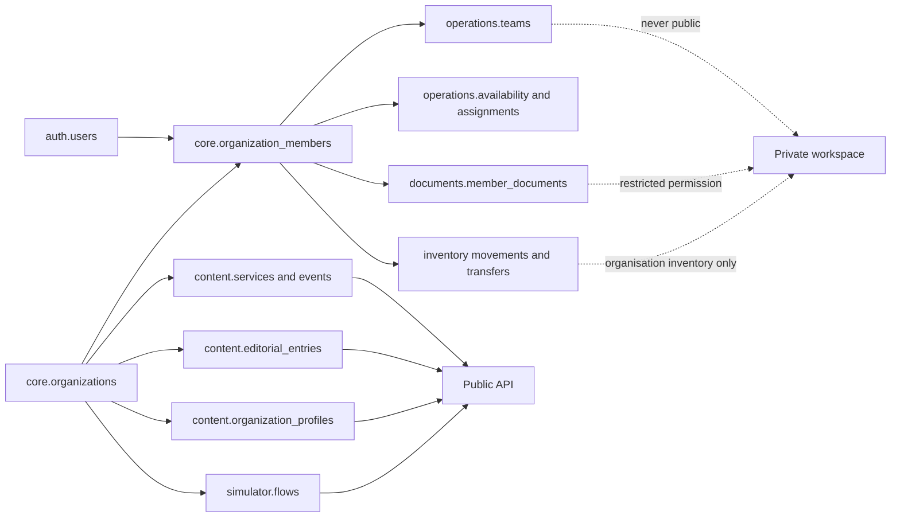

# InfoKit — PostgreSQL and Drizzle Schema Proposal

> This is a derived technical proposal. `PRODUCT.md` is authoritative for product scope, requirements, and data boundaries.

## Status

This document proposes the application schema for Phases 1–4. It is intended to become the source for Drizzle table definitions and migrations, but it is not yet a migration.

The proposal covers:

- Authentication, sessions, account recovery, invitations, and terms acceptance.
- Verified organisations, public profiles, roles, and organisation membership.
- Places, audience-labelled public services, provider organisations, schedules, closures, searchable needs, and public events.
- Articles, images/video, AI-translation provenance, custody transfer, revisions, and multi-organisation approval projections.
- The anonymous information simulator and its versioned decision graph.
- Files, PDFs, audio, video, contacts, and controlled taxonomies.
- Global and organisation-scoped tags with translations, color, and display order.
- Members, teams, the shared skill/course catalogue and its declarations, requirement sets, spoken languages, availability, agenda imports, missions, and assignments.
- Restricted volunteer/internship documents and signatures.
- Movement-ledger inventory, storage locations, items/lots, kits, reservations, transfers, distributions, and alerts.
- Notifications, audit events, and tenant isolation.

Assistance or beneficiary records are intentionally absent. If introduced later, they should use a separate database or service with different database credentials, authorization rules, retention, logging, and governance.

## 1. Recommended PostgreSQL Schemas

Use PostgreSQL schemas as domain boundaries while keeping one Drizzle project:

| PostgreSQL schema | Responsibility                                                                                | Public access                                 |
| ----------------- | --------------------------------------------------------------------------------------------- | --------------------------------------------- |
| `auth`            | Login identities, linked providers, sessions, verification, recovery, account settings        | No                                            |
| `core`            | Organisations, membership, invitations, roles, languages, terms                               | No                                            |
| `content`         | Public profiles, activities, reusable services, places, events, editorial information, files  | Published records only through the public API |
| `simulator`       | Versioned anonymous information-decision graphs                                               | Published versions only                       |
| `operations`      | Members, teams, availability, absences, planning, assignments, coordination agenda            | Only coordination events on the `public` tier |
| `documents`       | Restricted templates, files, signers, signature evidence                                      | No                                            |
| `inventory`       | Locations, item catalogue, movements, reservations, kits, transfers, alerts, restricted costs | No                                            |
| `notifications`   | Preferences, in-app notifications, delivery attempts, outbox                                  | No                                            |
| `audit`           | Append-only administrative, publishing, and restricted-access history                         | No                                            |



## 2. Global Conventions

### Identifiers and names

- Use UUID primary keys with `uuid(...).defaultRandom()`.
- Use snake_case in PostgreSQL and camelCase properties in TypeScript.
- Use `organization_id` on every organisation-owned record, even when it could be derived through another relation.
- Add a unique constraint on `(organization_id, id)` for tenant-owned parent tables.
- Use composite foreign keys such as `(organization_id, member_id)` so the database rejects cross-organisation relationships.
- Do not encode personal information in identifiers.

### Time

- Use `timestamptz` for moments such as publication, event occurrences, invitations, signatures, and audit events.
- Store the organisation or series IANA timezone, normally `Europe/Paris`, for recurring local schedules.
- Use `date` and local `time` for weekly service hours and recurring availability rules.
- Store generated event occurrences as `timestamptz` so daylight-saving changes are resolved before public display.

### Record lifecycle

- Prefer explicit statuses over `deleted_at` when a business lifecycle exists.
- Use `archived_at` for recoverable content removal.
- Never hard-delete published revision history, completed signatures, or required audit evidence from ordinary application code.
- Cascade only disposable join rows. Use `restrict` for published content, signed documents, and audit-referenced records.

### Workspace-only steward contact

Every content root — activities, editorial entries, catalogue services, places, public organisation profiles, simulator flows, and coordination events — carries `steward_name`, `steward_phone`, `steward_email`: who to ask inside the network when the record turns out to be wrong.

- These are plain columns on the record, not `content.contacts` rows. A contact row can be linked to a public surface by mistake; a column that no public query mentions cannot.
- No public read model selects them, and no public snapshot carries them. They are readable by signed-in editors of the owning organisation, and by other verified organisations wherever the record itself already crosses the workspace boundary.
- Audit metadata records that a steward contact was set or cleared, never the phone number or the address.

### Translations

- Keep translatable text in translation tables with a `language_code` foreign key.
- Do not store translations as a single JSON object; per-language rows need independent review and fallback behavior.
- Translation uniqueness is normally `(parent_id, language_code)` or `(revision_id, language_code)`.
- Keep translation quality (`draft`, `machine_generated`, `needs_review`, `verified`, `rejected`), assignment lifecycle, and locale publication in separate columns/tables.
- Pin each target translation and external assignment to an immutable source version with a source language, canonical payload, SHA-256 hash, author, and change impact.
- Store `human`/`ai`/`ai_then_human_review` provenance, provider job reference, target content hash, verification actor/time, and carry-forward source when applicable.

### Publication and revisions

- Separate the stable record identity from immutable revisions.
- A published-locale row points to the exact revision currently public for that language.
- Updating published content creates a new revision; it never overwrites the previous revision.
- Services, places, schedules, and events may be edited as typed rows, but every publication creates an immutable public snapshot for audit and rollback.
- A joint publication is sealed as one immutable approval bundle covering its exact snapshots, media, sources, freshness data, and proposed public organisations. Approval never carries to a changed bundle hash.

### Flexible and stable values

- PostgreSQL enums are appropriate for stable state machines such as invitation, publication, assignment, and signature status.
- Permission codes, speciality taxonomies, service categories, and document types should be rows, not enums. They will evolve without requiring enum migrations.
- Use `jsonb` only for bounded provider payloads, structured editor documents, audit metadata, and immutable public snapshots—not as a replacement for the relational model.

### Designing for expansion

The schema is designed to evolve through additive migrations, not to predict every future feature. Future expansion is supported by:

- Global users separated from organisation membership, allowing the same person to work with several organisations concurrently or sequentially.
- Stable membership identities separated from engagement periods, allowing a volunteer to leave, return, or later become staff without destroying history.
- Taxonomies, member types, permissions, document types, tags, skills, and languages stored as rows rather than hard-coded application enums.
- Typed many-to-many join tables, which allow additional associations without duplicating entity columns.
- Stable content identities with immutable revisions and per-language publication pointers.
- Revision-specific publication parties and approval bundles, allowing one or many organisations without adding `organization_2_id`-style columns.
- Private operational events separated from public events, with an explicit optional link.
- Provider-neutral authentication and signature metadata around provider-specific IDs/payloads.
- An append-only stock ledger and typed inventory joins, allowing new locations, item tracking policies, and movement types without rewriting balances.
- `jsonb` reserved for bounded extension points while important queryable fields stay relational.

“Future-proof” does not mean schema-free. New business concepts should normally receive an additive table/migration instead of being forced into a generic entity/value table.

## 3. Shared Drizzle Foundation

```ts
import { sql } from "drizzle-orm";
import {
  boolean,
  check,
  date,
  foreignKey,
  index,
  integer,
  jsonb,
  numeric,
  pgSchema,
  primaryKey,
  text,
  time,
  timestamp,
  unique,
  uuid,
} from "drizzle-orm/pg-core";

export const auth = pgSchema("auth");
export const core = pgSchema("core");
export const content = pgSchema("content");
export const simulator = pgSchema("simulator");
export const operations = pgSchema("operations");
export const documents = pgSchema("documents");
export const inventory = pgSchema("inventory");
export const notifications = pgSchema("notifications");
export const audit = pgSchema("audit");

export const timestamps = {
  createdAt: timestamp("created_at", { withTimezone: true })
    .notNull()
    .defaultNow(),
  updatedAt: timestamp("updated_at", { withTimezone: true })
    .notNull()
    .defaultNow(),
};
```

`updated_at` must be set by the application or a PostgreSQL trigger; `defaultNow()` only supplies the inserted value.

## 4. Authentication and Accounts

Authentication library choice may rename these tables, but the data boundaries should remain the same. Do not put organisation roles directly on `auth.users` because one account can belong to several organisations with different permissions.

### `auth.users`

Global login identity.

| Column                     | Type                   | Notes                                                         |
| -------------------------- | ---------------------- | ------------------------------------------------------------- |
| `id`                       | `uuid PK`              | Random identifier                                             |
| `display_name`             | `text nullable`        | Account-level display only                                    |
| `email`                    | `text`                 | Sole normalized sign-in address; globally unique              |
| `email_verified_at`        | `timestamptz nullable` | Authentication verification                                   |
| `password_hash`            | `text nullable`        | Versioned salted memory-hard hash; null until password is set |
| `password_updated_at`      | `timestamptz nullable` | Password security metadata                                    |
| `preferred_language_code`  | `text FK nullable`     | UI preference                                                 |
| `disabled_at`              | `timestamptz nullable` | Platform account suspension                                   |
| `last_login_at`            | `timestamptz nullable` | Security metadata                                             |
| `created_at`, `updated_at` | `timestamptz`          | Standard timestamps                                           |

One account has one sign-in email. Organisation-specific contact addresses may remain on `core.organization_members`, but they do not authenticate the global account. The one-email rule does not limit the number of organisation memberships.

### Authentication support tables

| Table                            | Purpose                                             | Important columns/constraints                                                                                                                        |
| -------------------------------- | --------------------------------------------------- | ---------------------------------------------------------------------------------------------------------------------------------------------------- |
| `auth.accounts`                  | External identity-provider linkage                  | `user_id`, `provider`, `provider_account_id`; unique provider identity                                                                               |
| `auth.sessions`                  | Revocable login sessions                            | hashed `session_token`, `user_id`, `expires_at`, `last_seen_at`, nullable `second_factor_verified_at`; never store raw tokens                        |
| `auth.verification_tokens`       | Email verification and passwordless login           | hashed token, purpose, email/user, expiry, consumed time                                                                                             |
| `auth.second_factor_challenges`  | Short-lived SMS verification for a specific session | user, hashed session token, keyed code digest, locale, delivery state, bounded attempts, expiry, consumed time; never store the phone number or code |
| `auth.user_second_factors`       | The number one account receives codes on            | `user_id PK FK`, E.164 `phone` (checked), nullable `verified_at`; one number per account, unusable until a code sent to it comes back                |
| `auth.password_reset_tokens`     | Single-use password recovery                        | hashed token, user, expiry, consumed time                                                                                                            |
| `auth.password_sign_in_attempts` | Identifier-level password throttle ledger           | HMACed normalized identifier, nullable resolved user, success flag, attempted time; bounded retention                                                |
| `auth.authenticators`            | Optional WebAuthn/passkey credentials               | credential ID, public key, counter, transports                                                                                                       |
| `auth.recovery_codes`            | Optional MFA recovery                               | one-way hash, user, consumed time                                                                                                                    |

Security events such as login failure, recovery, session revocation, MFA changes, and account disablement also create `audit.events` rows. IP addresses and user-agent retention require an explicit policy.

### `auth.user_settings`

One row per account holding what the person chose for themselves: interface, time, sign-in, and how they want to be told things. It is separate from `auth.users` so a preference write never touches a credential column, and so preferences may change often without rewriting the identity row.

| Column                                           | Type                   | Notes                                                                           |
| ------------------------------------------------ | ---------------------- | ------------------------------------------------------------------------------- |
| `user_id`                                        | `text PK FK`           | Account; cascade on delete                                                      |
| `preferred_language_code`                        | `text FK nullable`     | Interface language; null follows the request (URL, cookie, `Accept-Language`)   |
| `theme`                                          | `enum`                 | `system` (default) / `light` / `dark`                                           |
| `density`                                        | `enum`                 | `comfortable` / `compact` workspace density                                     |
| `reduced_motion`, `high_contrast`                | `boolean`              | Additional to the OS media queries, never a replacement                         |
| `sidebar_collapsed`, `landing_section`           | `boolean`, `enum`      | Console shape the person left behind                                            |
| `time_zone`, `clock_format`, `week_starts_on`    | `text`, `enum`, `int`  | IANA zone, 12/24-hour, ISO weekday 1–7; stored instants stay UTC                |
| `preferred_sign_in_method`                       | `enum`                 | `magic_link` / `password` / `passkey`; which method the login page offers first |
| `two_factor_enabled`, `two_factor_method`        | `boolean`, `enum`      | Enrolment state; on by default and not disableable by platform administrators   |
| `two_factor_updated_at`                          | `timestamptz nullable` | When enrolment last changed; the reason lives in `audit.events`                 |
| `digest`, `quiet_hours_start`, `quiet_hours_end` | `enum`, `time`, `time` | Digest cadence and the window in which non-urgent delivery waits                |
| `default_organization_id`, `default_city_id`     | `uuid FK nullable`     | Scope the console opens with; set null on delete                                |
| `created_at`, `updated_at`                       | `timestamptz`          | Standard timestamps                                                             |

A missing row means every default, so a new account needs no backfill and a read never depends on a prior write. Nothing here is a security control on its own: RBAC decides what a person may do, these columns decide what they are shown. The number itself is never here — it lives in `auth.user_second_factors` — and `two_factor_enabled` is re-checked server-side on every gated read against the roles the account holds: anyone holding a role marked `requires_second_factor` cannot switch it off.

There is no public signup, so the question "may this address hold a session at all" is answered by the database rather than by deployment configuration: a live platform-role grant, an organisation membership, a translator directory entry, or an unexpired invitation. That is what lets an administrator invite a colleague and assign their roles without anyone editing an environment file. The first account is seeded the same way (`BOOTSTRAP_SUPERADMIN_EMAIL`, granted the technical platform roles), so it is a row like any other. The login form still answers identically for every address; eligibility is checked where the answer never reaches the visitor — the magic-link email is not sent, and the link is refused at consumption.

The SMS step-up follows the role, not the person. An account holding a role marked `requires_second_factor` is asked for a phone number the first time it connects, before any private read, and told why: the reach of the role is the reason. The number is stored unverified until a code sent to it comes back, so a mistyped number never arms the gate and is corrected by enrolling again. Everyone else may enrol a number voluntarily from their account settings. Password and magic-link authentication both create the same revocable database session and both pass through that step-up. An authenticated, SMS-verified user may set or replace the password; the magic-link path remains the recovery route until a dedicated reset flow ships.

## 5. Organisations, Invitations, and Authorization

### Organisation tables

| Table                             | Purpose                                                                                             | Important columns                                                                                                                                                                       |
| --------------------------------- | --------------------------------------------------------------------------------------------------- | --------------------------------------------------------------------------------------------------------------------------------------------------------------------------------------- |
| `core.organizations`              | Stable private organisation identity                                                                | `id`, `slug`, legal/display name, optional founding year, timezone, status, publishing suspension                                                                                       |
| `core.organization_verifications` | Platform verification and duplicate/impersonation review                                            | organisation, reviewer, method, status, notes, evidence asset, decision times                                                                                                           |
| `core.organization_members`       | Stable person/account identity inside one organisation                                              | organisation, nullable user, **required** first/last name, contact email, phone and title, status, first/last seen times                                                                |
| `core.city_teams`                 | Full area team responsible for one organisation's work in one city                                  | organisation, city, name, active state; unique organisation/city                                                                                                                        |
| `core.city_team_members`          | Private membership of an organisation's city team                                                   | organisation, city team, member, active state                                                                                                                                           |
| `core.member_types`               | Extensible participation type catalogue                                                             | code such as staff/volunteer/intern, label key, active state, display order                                                                                                             |
| `core.member_engagements`         | Historical period and type of participation                                                         | organisation, member, member type, start/end dates, status, ended reason                                                                                                                |
| `core.invitations`                | Phase 1 publisher, Phase 2 admin/editor, Phase 3 member, translator, and platform-staff invitations | nullable organisation, email/phone, invitation kind, hashed token, inviter, nullable inviting member (Phase 1.3 colleague invites), nullable translator, expiry, accepted/revoked times |
| `core.invitation_roles`           | Roles that will be granted on acceptance                                                            | invitation, role                                                                                                                                                                        |
| `core.translators`                | An external translator's own identity and profile                                                   | nullable user, nullable owning organisation, display name, contact email, headline, bio, timezone, status, directory scope, activation times                                            |
| `core.translator_languages`       | The pairs one translator works in                                                                   | translator, language, translates into/from flags, note                                                                                                                                  |
| `core.legal_documents`            | Versioned privacy notice, platform terms, and publishing responsibilities                           | kind, version, language, asset/content, effective date                                                                                                                                  |
| `core.legal_acceptances`          | Evidence that a user accepted a specific version                                                    | user, organisation nullable, legal document, accepted time, evidence metadata                                                                                                           |

Five columns identify a member and all five are `not null`: `first_name`, `last_name`, `title` (the function held in the association, not a civility), `phone` and `contact_email`. The constraint lives in the table rather than in one form because every path that creates a member — a city-team invitation, an activity assignment by email, a platform invitation of an organisation's representative — has to produce a row a coordinator can act on: a name to sort and address, a number to dial at short notice, an address to write to. The name is stored as two columns and never as one string, so "who is this?" and "how is this list ordered?" stay separate questions. `phone` is kept as typed rather than normalised to E.164, because an association writes down the number it actually dials — an extension or a shared duty line. `org_members_org_email_uq` makes the address the identity inside one organisation, which is what lets an assignment reuse an existing member instead of creating a second row for the same person.

A member does not need a city team. `core.city_team_members` is an optional link, so somebody can be on the books before there is a team to put them on; `/dashboard/team` keeps those unassigned members in view and moving one between teams is a delete-and-insert of that link, never a change of identity.

Who may open that board is `members.read`, not "is signed in to the console": it is every member of every organisation in scope with the address and the number each of them left, held at the same notch as the contact details on an organisation's own record. `~/server/auth/authorization`'s `permissionScope` answers whose — an active role test first and alone, then the platform's own grants and support access, then the organisations where an active membership grants the code — and every query the page runs is filtered to that answer, including the organisation dropdown, so a coordinator sees their own roster and nobody else's. No grant at all is a refusal with an `access.denied` row, and the sidebar hides the entry for readers the page would refuse rather than manufacturing denials from a link the console offered.

`core.organization_members.user_id` stays nullable until an invited person creates or links an account. One `auth.users` row may be referenced by memberships in any number of organisations. Offboarding deactivates only that organisation relationship and its permissions; it does not delete the global account, affect another organisation, move content custody, or rewrite authored audit history.

`core.member_engagements` preserves changes over time. For example, one membership can have a volunteer engagement, an ended period, and a later staff engagement without rewriting history. A partial unique index may limit a member to one active engagement if pilot policy requires it; the model can also permit overlapping engagement types later.

`core.translators` is deliberately not an `organization_members` row. A translator works for the network, not inside one organisation's membership: they hold no organisation roles, and their `owner_organization_id` only records who brought them in. `directory_scope` answers who may send them work — `organization` keeps them to the organisation that invited them, `all_organizations` lists them for everyone. The contact email is unique across the directory, normalized, and is the address the invitation is sent to; a null `user_id` means the invitation has not been accepted yet, and a database check keeps `activated_at` and `user_id` set together.

Translator and platform-staff invitations reuse `core.invitations`, because the lifecycle is the same one — a hashed single-use token, an expiry, an acceptance proved by signing in with the invited address. `invitations_target_check` makes each kind's target explicit: `translator` requires a `translator_id` and links a `core.translators` row, `platform_admin` requires neither an organisation nor a translator, and every other kind requires an organisation and no translator. Both of the organisation-less kinds bypass membership linking, so accepting one never produces organisation access: a translator's acceptance opens their own space and grants the platform `translator` role, and a platform-staff acceptance inserts the invited roles into `core.user_platform_roles`.

The `translator` platform role is deliberately the smallest one in the catalogue: `translator.workspace.read`, `content.translation.submit`, `translator.profile.manage`. It reads the assignments addressed to that translator's own `core.translators` row and nothing else, submits those translations, and maintains the profile — no organisation membership, no directory, no other tenant's content.

### Role and permission tables

| Table                          | Purpose                                       | Key                                                                                                                                            |
| ------------------------------ | --------------------------------------------- | ---------------------------------------------------------------------------------------------------------------------------------------------- |
| `core.roles`                   | Platform-defined or organisation-defined role | `id`; nullable `organization_id` means platform template; `requires_second_factor`                                                             |
| `core.permissions`             | Extensible permission catalogue               | text `code PK`, description, sensitivity level                                                                                                 |
| `core.role_permissions`        | Permission grant to role                      | `(role_id, permission_code)`                                                                                                                   |
| `core.member_roles`            | Role assignment inside one organisation       | `(organization_id, member_id, role_id)` plus grant/review/expiry metadata                                                                      |
| `core.user_platform_roles`     | Global platform-role assignment               | `(user_id, role_id)` plus grant/expiry metadata                                                                                                |
| `core.role_test_contexts`      | Session-bound superadmin role test context    | session, real actor, compatibility primary role, optional organisation, start/update                                                           |
| `core.role_test_context_roles` | Roles combined in one superadmin test context | `(session, role)`; permissions are the union of every selected role                                                                            |
| `core.permission_reviews`      | Periodic review campaign                      | organisation, state, due date, assignee held to the same organisation, started/completed metadata, summary; one open campaign per organisation |
| `core.permission_review_items` | Decision for one assignment                   | review and member both held to the campaign's organisation, role, keep/revoke, decision metadata, applied at — set only on a revoke            |

Currently approved permission catalogue:

```text
support.superadmin                  organization.verify
taxonomy.manage                     audit.read
content.article.write               content.article.publish
content.article.review              content.joint_publication.approve
content.article_custody.transfer    content.activity.manage
content.activity.verify             content.simulator.review
content.translation.request         content.translation.submit
content.translation.review          content.translation.verify
organization.profile.manage         platform.staff.manage
members.read                        members.manage
roles.manage                        teams.manage
planning.manage                     coordination.event.manage
documents.prepare                   documents.send
documents.sign_assigned             documents.read_all
documents.audit                     inventory.read
inventory.locations.manage          inventory.catalog.manage
inventory.move                      inventory.transfer.approve
inventory.financial.read            inventory.audit.read
translator.directory.manage         translator.workspace.read
translator.profile.manage           courses.manage
courses.qualification.verify
```

Permissions are atomic and do not inherit from one another. Platform-defined
role templates explicitly grant every capability they provide; an organisation
member may hold several roles, whose grants combine only within that membership.
For example, an article publisher template grants both `content.article.write`
and `content.article.publish`, while a translation reviewer may hold only
`content.article.review`. Likewise, `content.activity.manage` does not imply
`content.activity.verify`.

`platform_operator` grants `organization.profile.manage` alongside
`organization.verify`, `taxonomy.manage`, and `audit.read`: the platform
maintains a directory record until the organisation claims it. The grant is not
revoked on claim — `core.organizations.claimed_at` is what turns platform write
access into read-only (PRODUCT.md §11.3, the claim rule), while an
organisation's own members keep writing through their membership roles.

Platform work is split by kind, not by seniority. `platform_superadmin` is the
technical account: `support.superadmin`, `audit.read`, and
`platform.staff.manage` — support access, the audit trail, and the authority to
staff the platform. It grants no content permission at all, so editorial work
happens under `platform_content_manager`, whose grants are exactly the article,
activity, simulator, and translation capabilities. Both are assigned globally in
`core.user_platform_roles`. One deployment-configured address is seeded as the
superadmin (`BOOTSTRAP_SUPERADMIN_EMAIL`, `platform_superadmin` +
`platform_operator`); every other platform account arrives by invitation from it.
The separation is hygiene rather than a wall — `support.superadmin` can role-test
into a content context — so audit reads, not permission arithmetic, are what show
who edited what.

Each of those platform roles, and `organization_admin` — the steward of an
organisation's own members and roles — carries `requires_second_factor`. The flag
is a property of the role, not of the person: a role that gains reach later flips
one row instead of hunting through accounts, and the reason the enrolment page can
give a holder is exactly the reach they were granted. `translator` deliberately
does not carry it, so an invited translator is never asked for a phone number to
read the assignments addressed to them.

`platform_superadmin`'s global assignment in `core.user_platform_roles` is what
authorizes role testing. A
test context replaces effective feature permissions with the union of the
selected roles' explicit grants without rewriting memberships or global
assignments. Every enter, switch, and exit records the real actor and selected
roles. The authorization service must recheck the actor's actual
`support.superadmin` grant on every request and ignore or remove the context if
that grant or its database session expires.

## 6. Languages, Taxonomies, and Public Organisation Profiles

### Shared catalogue tables

| Table                                    | Purpose                                                                                                                                                              |
| ---------------------------------------- | -------------------------------------------------------------------------------------------------------------------------------------------------------------------- |
| `core.languages`                         | BCP 47 code, native name, English/French name, direction, enabled state, fallback code, public sort order                                                            |
| `core.cities`                            | City/territory catalogue: code, timezone, active state; activating one surfaces it in public filters and the simulator city question                                 |
| `core.city_translations`                 | City name by language                                                                                                                                                |
| `core.city_areas`                        | Ordered public areas of a city, used by the simulator location question: code, display order, optional latitude/longitude, active state                              |
| `core.city_area_translations`            | City-area label by language                                                                                                                                          |
| `content.service_categories`             | Broad grouping code (for example essentials, health/wellbeing, or connectivity), icon, public color token, enabled state                                             |
| `content.service_category_translations`  | Category label and description by language                                                                                                                           |
| `content.audience_categories`            | Controlled audience code (`all_public`, `women_only`, `children_only`, `under_18_only`, `families_only`, `adult_men_only`), icon/token, enabled state, display order |
| `content.audience_category_translations` | Audience label and explanation by language; providers still supply record-specific eligibility detail                                                                |
| `content.specialities`                   | Controlled association-speciality code and icon                                                                                                                      |
| `content.speciality_translations`        | Speciality label and description by language                                                                                                                         |
| `content.search_concepts`                | Stable need/topic concept such as breakfast, shoes, tents, water, or device charging, with optional mapped service category                                          |
| `content.search_concept_translations`    | Preferred search label by language                                                                                                                                   |
| `content.search_concept_aliases`         | Language-specific normalized synonyms, common spellings, and typo aliases for autocomplete                                                                           |
| `content.service_search_concepts`        | Verified need concepts satisfied by a service                                                                                                                        | `(service_id, search_concept_id)`, verified by/at |

### Flexible tags

Tags supplement controlled categories and specialities. They must not replace permissions, lifecycle statuses, or verified service/speciality taxonomies.

| Table                            | Purpose                                                | Important columns                                                                                             |
| -------------------------------- | ------------------------------------------------------ | ------------------------------------------------------------------------------------------------------------- |
| `core.tags`                      | Global or organisation-scoped tag                      | nullable organisation, namespace, code, color, display order, visibility (`public`/`workspace`), active state |
| `core.tag_translations`          | Localized tag label and optional description           | tag, language, label, description                                                                             |
| `content.organization_tags`      | Tag assigned to a public organisation profile          | organisation/profile, tag, optional display-order override                                                    |
| `content.service_tags`           | Tag assigned to a public service                       | service, tag, optional display-order override                                                                 |
| `content.public_event_tags`      | Tag assigned to a public event                         | event, tag, optional display-order override                                                                   |
| `content.editorial_entry_tags`   | Tag assigned to an article/fixed/basic entry           | entry, tag, optional display-order override                                                                   |
| `content.asset_tags`             | Tag assigned to a download/media record                | asset, tag, optional display-order override                                                                   |
| `operations.member_tags`         | Workspace-only member tag when operationally justified | organisation, member, tag                                                                                     |
| `operations.team_tags`           | Workspace-only team tag                                | organisation, team, tag                                                                                       |
| `operations.calendar_event_tags` | Workspace-only shift/mission/meeting tag               | organisation, event, tag                                                                                      |

Recommended `core.tags` behavior:

- `organization_id = null` means a platform-managed global tag; a value means the tag belongs to that organisation.
- `namespace` groups expandable uses such as `topic`, `audience`, `programme`, or `operational` without creating one ambiguous flat list.
- `color` stores an approved semantic token or validated color value. Text labels remain mandatory; color is never the only meaning.
- `display_order` supplies the default order. A typed assignment may override it for one screen/context.
- Uniqueness is `(organization_id, namespace, code)`, treating null organisation IDs as equal for global tags.
- Deactivation preserves assignments/history while hiding the tag from new selection.
- Typed join tables preserve real foreign keys. Avoid one polymorphic `tag_assignments(entity_type, entity_id)` table.

### Public association profile

| Table                                       | Purpose                                                     | Important columns                                                                                                                                       |
| ------------------------------------------- | ----------------------------------------------------------- | ------------------------------------------------------------------------------------------------------------------------------------------------------- |
| `content.organization_profiles`             | Public, reviewable part of an organisation                  | organisation, logo asset, website, discovery source URL/check date, visibility, last verified, review due, active publication snapshot                  |
| `content.organization_profile_translations` | Public narrative by language                                | profile, language, purpose, optional goals/values, accessibility summary, translation state                                                             |
| `content.organization_search_aliases`       | Verified former/common names used by autocomplete           | organisation, language, alias, normalized alias, active state, verified by/at                                                                           |
| `content.organization_specialities`         | Effective-dated speciality assignment/history               | organisation, speciality, state (`requested`, `verified`, `rejected`, `retired`), `is_primary`, display order, requested/verified/retired by/at, reason |
| `content.speciality_change_requests`        | One admin-submitted change set                              | organisation, state, rationale, submitter, reviewer and review note, submitted/reviewed times; one open change set per organisation                     |
| `content.speciality_change_items`           | Add, remove, reorder, or set-primary action in a change set | request held to the change set's organisation, speciality, action, requested order for a reorder, per-item decision and note, decided at                |
| `content.organization_languages`            | Languages in which service can actually be provided         | organisation, language, proficiency/scope, verified at                                                                                                  |
| `content.contacts`                          | Safe public or restricted contact method                    | organisation, type, value, visibility, purpose, active hours                                                                                            |
| `content.contact_translations`              | Contact label and instructions                              | contact, language, label, instructions                                                                                                                  |

A change set is decided per item, not as a whole: an admin asking to add two specialities and reorder a third may be approved on one and refused on another, and `partially_approved` is a real outcome rather than a workaround. A set decided once cannot be decided again — a CHECK ties the terminal states to the reviewer and the review time being present.

An organisation can have many specialities. Enforce no more than one effective verified assignment with `is_primary = true` through a partial unique index. Marking a primary is optional: an organisation providing several services with equal weight (water and food, showers and laundry, mental and physical care) marks none, and the public card renders its specialities co-equally. Admins can retire a public assignment without deleting history. Additions and changed claims remain non-public until a platform reviewer verifies them. The Phase 1 product currently displays up to four secondary specialities, but that is a configurable publication/UI rule, not a storage limit or database trigger.

## 7. Places, Activities, Reusable Services, Schedules, and Public Events

### Places and service delivery

| Table                                    | Purpose                                                                                        | Important columns                                                                                                                                                                                                                                          |
| ---------------------------------------- | ---------------------------------------------------------------------------------------------- | ---------------------------------------------------------------------------------------------------------------------------------------------------------------------------------------------------------------------------------------------------------- |
| `content.places`                         | A public or internal physical place                                                            | organisation, city, address fields, point/coordinates, publication precision, archive state                                                                                                                                                                |
| `content.place_translations`             | Name and safe directions text                                                                  | place, language, translation state                                                                                                                                                                                                                         |
| `content.activities`                     | Scheduled, confirmable visitor-facing offering                                                 | nullable coordinating organisation/team, city, optional place, category, audience, source language, creation actor/scope, platform-provisioned flag, status, publication state, last verified, review due, archive state                                   |
| `content.activity_translations`          | Public name, description, instructions, uncertainty/cancellation copy                          | activity, language, source version, quality state, method, content hash, provider job, carry-forward source version, verified by/at                                                                                                                        |
| `content.activity_publications`          | Active/history pointer for one locale translation                                              | activity, language, source version, translation content hash, approved/published time, optional scheduled activation time, unpublished actor/time; one active row per activity/language                                                                    |
| `content.activity_creator_organizations` | Organisations that originated or co-authored the activity                                      | activity, organisation, proposed/confirmed/rejected/retired state, proposing/confirming actors and times                                                                                                                                                   |
| `content.activity_providers`             | One or more associations proposed or confirmed to provide the activity                         | activity, organisation, relationship state, role, display order, proposing/confirming actors and effective times; at least one confirmed verified provider before publication, or no rows at all when the platform holds and publishes the activity itself |
| `content.activity_verifications`         | Immutable organisation-scoped activity verification evidence                                   | activity/provider organisation, verifying user/member, method, optional scope hash/source version, verification and validity times                                                                                                                         |
| `content.activity_audience_translations` | Provider-supplied audience/eligibility explanation                                             | activity, language, plain-language details, translation state                                                                                                                                                                                              |
| `content.services`                       | Reusable capability such as food, showers, legal information, or phone connectivity            | optional owning organisation (`null` for platform-managed global catalogue capability), broad category, stable code, icon, active/archive state                                                                                                            |
| `content.service_translations`           | Reusable service label and description                                                         | service, language, translation state                                                                                                                                                                                                                       |
| `content.activity_services`              | Many-to-many service availability within an activity                                           | `(activity_id, service_id)`, active state, display order                                                                                                                                                                                                   |
| `content.activity_tags`                  | Flexible public labels selected from the shared or organisation catalogue                      | `(activity_id, tag_id)`, display order; tags never grant access                                                                                                                                                                                            |
| `content.activity_contacts`              | Organisation-approved safe contact methods attached as public next steps                       | `(activity_id, contact_id)`, display order; application validation keeps contacts inside the coordinating organisation                                                                                                                                     |
| `content.activity_transit_links`         | How to reach the activity on public transport, one row per useful line                         | activity, mode (`transit_mode`), line as the network prints it, stop or station name, optional walking minutes, display order                                                                                                                              |
| `content.activity_member_assignments`    | Private activity-team subset assignment with expertise and optional approved public projection | organisation, activity, city-team member, expertise, visibility, separately authored public display name/expertise, active state                                                                                                                           |
| `content.activity_assets`                | Images, flyers, audio, or documents attached to the mutable activity                           | activity, asset, attachment role, language, display order, active state                                                                                                                                                                                    |
| `content.activity_claim_requests`        | Secure provisional claim or coordinating-custody transfer request                              | activity, destination organisation/team, previous coordinator/team snapshot, token hash, state, expiry/consumption/decision actors and times                                                                                                               |
| `content.activity_custody_events`        | Typed append-only activity claim/transfer history                                              | activity/request, action, actor/scope, old/new organisation and team, asset/assignment disposition, occurred time                                                                                                                                          |

Every place references a `core.cities` row. Activating a city automatically surfaces it in public city filters and as a simulator city question — territory expansion is a data change, not a schema or code change.

Treat `content.activities` as visitor-facing offerings and `content.services` as reusable capabilities. Broad service categories group the catalogue; they are not selectable substitutes for concrete services. Global services have `organization_id = null` and are managed only by the audited superadmin; organisation-scoped services carry their owner ID. Editors see this scope explicitly when selecting either services or tags. `activities.organization_id` identifies the one coordinating tenant/custodian and `team_id` its city team; neither column is the complete factual attribution model. An activity may have several creator organisations, confirmed providers, and verifying organisations through typed many-to-many/event tables. A known organisation is linked provisionally when the platform enters information on its behalf; `organization_id` is null only for unknown-provider provisional intake or for an activity the platform holds and publishes as its own, which carries no creator or provider row. The activity team in `content.activity_member_assignments` is an operational subset of the coordinating city team, not a second owner and not a replacement for the activity's city-team relationship. Each activity keeps its own place, schedule, audience, status, contact, and freshness. Capabilities are attached through `content.activity_services`: an activity can have many services and a service can belong to many activities. Sharing a service never shares or copies an activity's schedule, status, place, audience, or verification evidence.

`created_by_id` identifies the initiating account; `created_by_scope` is the actor scope (`platform`, `organization`, or `system`), not an RBAC role. `provisioned_by_platform` is immutable origin provenance and may remain true after an organisation accepts or claims the activity. It never inserts the platform as a factual provider: a platform-published activity has no `activity_providers` row, and its responsibility is read from `organization_id IS NULL` together with `created_by_scope = 'platform'`. Creator/provider relationships added on behalf of organisations start as `proposed`; an authorised representative confirms them. Temporary launch allowance: until that acceptance exists in the product, the platform editor who publishes a linked organisation's activity confirms its provider relationship, so `confirmed_by_id` holds the platform editor rather than a representative of the organisation. Verification remains separate from provision and is append-only per organisation.

An activity claim request stores only a token hash. Acceptance locks the activity, checks destination authority and token expiry/consumption, maps or creates the destination city team, updates coordinating custody only when needed, and inserts an immutable custody event. An already-linked provisional organisation confirms without an ID change. Previous member assignments are ended or flagged for reconfirmation rather than silently re-scoped. Asset transfer/copy disposition is explicit and recorded; immutable publication snapshots continue referencing the exact historical asset hashes.

`content.activity_translations` stores the localized title plus sanitized rich-description HTML and server-derived plain text. The plain text supports previews and search without re-parsing author input; `short_description` remains a bounded compatibility preview. Authoring never stores unsanitized editor HTML, and media elements are excluded from activity descriptions.

Example: one MFS day-centre activity can attach laundry, shower, charging, social assistance, food, drinking water, and welcome-kit services. A separate MFS mobile-outreach activity can attach drinking water and phone charging again. Both activities remain independent even though they share capabilities, a provider, or a place.

An email-first member assignment creates or reuses `core.organization_members`; `user_id` stays null until an account authenticates with that verified address. An address that matches nobody creates the member, so the assignment has to state the five required identity fields — an activity assignment cannot conjure a member out of an email address; an address that does match keeps the identity the roster holds, because an assignment says what somebody brings to that activity, not what their name is. The assignment first adds or reactivates `core.city_team_members`, then adds the member to the activity team through `content.activity_member_assignments`, so both memberships are present after identity linking. Public mode does not project the member row. It may expose only the separately approved public display name and public expertise stored on the activity assignment; email, phone, account ID, the member's own name and title, profile, availability, and other assignments remain excluded.

This member-assignment path remains behind the Phase 3 legal/operator gate in persistent environments. Before the gate, it may be developed and verified only against clearly labelled fictional local data; it must not become a route for collecting real volunteer personal data.

Transport links hang off the activity, not off the place, even though a place is where the bus actually stops. A place row is optional — a mobile or city-wide activity has none — and the people who know which line serves the door are the ones editing the activity rather than the directory. The accepted cost is duplication: two activities at one address each carry their own rows, and a renamed stop is corrected in both. The same rows exist once more for coordination events (§13) for the same reason, so an event announced at a free-text meeting point can still say how to reach it. Nothing in either table enters the translation pipeline: `mode` is a `transit_mode` enum rendered from a localized label, while the line and the stop stay in the network's own spelling, because a stop nobody can read out to a driver is no help. A row must name a line or a stop (`*_detail_check`) and a walk stays within four hours (`*_walk_check`); saving replaces the whole list, so no unique key is imposed on what is otherwise free text, and `display_order` is the order the editor chose and the order a visitor reads.

Use PostGIS `geography(Point, 4326)` with a GiST index for distance queries. If PostGIS is deliberately deferred, use validated latitude/longitude numeric columns and accept that radius search will be less capable.

### Recurring activity availability

| Table                                       | Purpose                                                                | Important columns                                                                                                                           |
| ------------------------------------------- | ---------------------------------------------------------------------- | ------------------------------------------------------------------------------------------------------------------------------------------- |
| `content.schedule_rules`                    | Weekly recurring activity hours                                        | activity, weekday, fixed/flexible timing mode, local start/end window, effective dates, public-holiday behavior                             |
| `content.schedule_exceptions`               | Date-scoped closure, cancellation, exceptional opening, or uncertainty | activity, affected date/time, kind, created by; localized public reason lives in the translation table                                      |
| `content.schedule_exception_translations`   | Localized public reason for one exception                              | exception, language, public reason, translation state                                                                                       |
| `content.activity_occurrence_confirmations` | Immutable evidence that one scheduled occurrence was checked that day  | activity, confirming provider organisation nullable for platform intake, local date, confirmed time/user; unique activity/date/organisation |

Schedule checks enforce `start_time < end_time` unless an explicit `ends_next_day` flag is true. `fixed` means the window is expected to be exact; `flexible` means the window is approximate and public UI must advise confirmation. Creation accepts one to seven independently timed weekday rows, with add/remove controls; multiple rules per weekday represent split days, and transactional server validation rejects overlaps. An exception is either full-day (both times null) or partial-day (both present with start before end); several non-overlapping windows of the same kind may exist on one date. French public-holiday behavior is stored on the rule, not inferred from UI copy. Same-day confirmation inserts immutable date- and organisation-scoped evidence and may update the activity-level `last_verified_at`/`review_due_at` summary. A later cancellation or uncertainty does not delete the earlier evidence. Browsing another calendar date never refreshes public data.

### Public events

Public events remain separate from private shifts and missions. Linking them must never expose assigned member names or availability.

| Table                                          | Purpose                                                    | Important columns                                                                                                                    |
| ---------------------------------------------- | ---------------------------------------------------------- | ------------------------------------------------------------------------------------------------------------------------------------ |
| `content.public_events`                        | Stable public event/temporary distribution identity        | coordinating organisation, place, category, source language, status, recurrence series, last verified, review due                    |
| `content.public_event_providers`               | One or more verified associations that provide the event   | event, organisation, provider role, display order, effective dates; at least one active provider before publication                  |
| `content.public_event_audience_policies`       | Required launch audience classification and age bounds     | event PK/FK, audience category, nullable minimum/maximum age, verified by/at                                                         |
| `content.public_event_audience_translations`   | Provider-supplied event eligibility explanation            | audience policy, language, plain-language details, translation state                                                                 |
| `content.public_event_translations`            | Name, description, instructions, cancellation reason       | event, language, source version, quality state, method, content hash, provider job, carry-forward source version, verified by/at     |
| `content.public_event_publications`            | Active/history pointer for one locale translation          | event, language, source version, translation content hash, published/unpublished actors and times; one active row per event/language |
| `content.public_event_series`                  | Recurrence definition                                      | event, timezone, local start, duration, RRULE or controlled recurrence fields, effective dates                                       |
| `content.public_event_occurrences`             | Materialized concrete occurrences                          | event, starts/ends at, state, exception source; unique event/start                                                                   |
| `content.public_event_occurrence_translations` | Localized public reason for a changed/cancelled occurrence | occurrence, language, public reason, translation state                                                                               |
| `content.public_event_services`                | Services available during the event                        | `(event_id, service_id)`                                                                                                             |

Materialize a rolling occurrence window, for example the next six months, whenever a series or exception changes. Public `open now` and calendar queries should not have to interpret every recurrence rule at request time.

The publishing transaction rejects a service/event with no audience policy, and one with no effective verified provider unless the platform holds it itself — an activity with a null coordinating organisation is published under the platform, which is why the gate reads provider _or_ platform rather than provider alone. Public snapshots include each approved provider's organisation name and logo asset; the UI pairs every logo with the text name, and omits the provider line entirely when there is none. The six launch audience codes remain catalogue rows, so later policy can add categories without altering service/event tables. `children_only` and `under_18_only` stay separate codes and rely on provider-approved translated details and explicit age bounds rather than application inference.

## 8. Articles, Fixed Information, and Basic Information

These three products share revision, translation, source, freshness, and publication behavior, so use one editorial base with typed detail tables.

### Stable entry and immutable revisions

| Table                                         | Purpose                                                            | Important columns                                                                                                                                                                                                                   |
| --------------------------------------------- | ------------------------------------------------------------------ | ----------------------------------------------------------------------------------------------------------------------------------------------------------------------------------------------------------------------------------- |
| `content.editorial_entries`                   | Stable editorial identity                                          | kind (`article`, `fixed_information`, `basic_information`), internal slug, nullable city, workflow state, archived time; null city means global reach                                                                               |
| `content.editorial_entry_routes`              | Stable localized public URL                                        | entry, language, slug, retired time; one active route per entry/language and one owner of a language/slug pair, including retired routes                                                                                            |
| `content.editorial_entry_tags`                | Approved public tags on an entry                                   | entry, tag, display order                                                                                                                                                                                                           |
| `content.editorial_entry_assets`              | Entry-level media identity                                         | entry, asset, role (`cover`/`inline`), display order; at most one cover image                                                                                                                                                       |
| `content.editorial_revisions`                 | Immutable authored revision                                        | entry, revision number, author, source language, structured body schema version, can become outdated, unreliable from, last reviewed, review due, source summary, created time                                                      |
| `content.editorial_revision_translations`     | Localized content for one revision                                 | revision, language, source version, title, summary, structured body JSON, plain-text fallback, quality state, method, content hash, provider job, carry-forward revision, verified by/at                                            |
| `content.editorial_publications`              | Typed pointer to the exact revision/snapshot public for one locale | entry, language, revision, source version, translation content hash, publication snapshot, approval bundle nullable, published by/at, optional scheduled activation time, unpublished at; one active publication per entry/language |
| `content.article_details`                     | Article-only metadata                                              | entry PK/FK, article date, featured state                                                                                                                                                                                           |
| `content.fixed_information_details`           | Fixed-information metadata                                         | entry PK/FK, topic code, review interval days                                                                                                                                                                                       |
| `content.basic_information_details`           | Basic-information tile metadata                                    | entry PK/FK, icon, priority, matching service-category filter, emergency flag                                                                                                                                                       |
| `content.editorial_custodianships`            | Effective-dated administrative control of an entry                 | entry, custodian kind (`organization`/`platform`), nullable organisation, started/ended times, accepted by; one active row                                                                                                          |
| `content.editorial_custody_transfer_requests` | Admin-only proposed custody change                                 | entry, destination kind and organisation, previous organisation, requester, state, token hash, expiry, consumed at, decision maker and time, reason; one pending request per entry                                                  |
| `content.editorial_custody_transfer_events`   | Append-only transfer history and notes                             | entry, originating request nullable, previous and new organisation, actor, action, safe note, time                                                                                                                                  |

`structured_body` may use a versioned editor JSON format, but it must be validated and rendered through an allowlist. Keep `plain_text_fallback` for low-bandwidth rendering and search.

A transfer request stores a hash of its single-use token and never the token, expires on a required date, and is consumed exactly once — CHECKs tie the terminal states to `consumed_at` and to a decision maker. A partial unique index allows one pending request per entry, so an entry cannot be offered to two organisations at the same time, and a further CHECK refuses a request whose destination is where custody already is. The history table keys the entry directly rather than only the request, so the record of who held what survives a request being deleted, and it names the organisations on both sides of each move.

### Sources, approvals, relationships, and review

| Table                                      | Purpose                                                                 | Important columns                                                                                                                                |
| ------------------------------------------ | ----------------------------------------------------------------------- | ------------------------------------------------------------------------------------------------------------------------------------------------ |
| `content.sources`                          | Traceable factual source                                                | title, publisher, URL/reference, source/retrieval dates, owner                                                                                   |
| `content.editorial_revision_sources`       | Sources supporting a revision                                           | revision, source, role, display order                                                                                                            |
| `content.editorial_revision_organizations` | Organisations named in or responsible for the authored revision         | revision, organisation, relationship role; public attribution is separately sealed in the approval bundle                                        |
| `content.review_tasks`                     | Review/freshness queue                                                  | entity/revision, assignee, due date, status, resolution                                                                                          |
| `content.editorial_related_entries`        | Editorial relationships                                                 | source entry, related entry, relation kind                                                                                                       |
| `content.editorial_related_services`       | Related service links                                                   | entry, service, relation kind, display order                                                                                                     |
| `content.editorial_related_organizations`  | Related association links                                               | entry, organisation, relation kind, display order                                                                                                |
| `content.editorial_related_contacts`       | Related safe contact links                                              | entry, contact                                                                                                                                   |
| `content.editorial_revision_assets`        | Download/media embedded or attached to an exact authored revision       | revision, asset, role, language, display order, optional structured block key                                                                    |
| `content.translation_jobs`                 | Provider-neutral AI translation request/provenance                      | entity kind/ID, immutable source version, target language, method, provider/model/job ID, state, output payload/hash, requester, lifecycle times |
| `content.translation_provenance`           | Public notice and review provenance attached to a typed translation row | translation job, translated entity kind/ID, method, AI-used flag, reviewer, verified time                                                        |

The public outdated warning is derived from the published revision's `unreliable_from`; it should not be stored as manually edited display text. Public translation views derive a localized “translated from X to Y using AI” notice from `translation_provenance` whenever `ai_used = true`, including after human verification.

Custody transfer does not update historical revision organisations or publication parties. A transaction locks the entry, validates source-admin/platform-admin authority and destination acceptance, ends the old custodianship, and inserts the new row. Moving a user between organisation memberships does not call this workflow.

### Translator assignments (Phase 1.3)

Human translator link sharing (`PHASE-1.3-COLLABORATION.md`) stays distinct
from the AI `translation_jobs`/`translation_provenance` tables above. A sender
assigns one pinned content source version and target language to one external
translator.

The sender picks that translator from the `core.translators` directory, filtered
by the target language and by who may be sent work (`directory_scope`), or still
types an address by hand. `translator_email`/`translator_name` therefore stay
authoritative on the assignment — they are the history of what was actually
mailed, and they outlive any later edit to the directory entry — while
`translator_id` is the optional link back to it. An assignment link is still a
scoped session over one payload: it is not what a translator signs in to.

| Table                                   | Purpose                                                              | Important columns                                                                                                                                                                                                                                                                                    |
| --------------------------------------- | -------------------------------------------------------------------- | ---------------------------------------------------------------------------------------------------------------------------------------------------------------------------------------------------------------------------------------------------------------------------------------------------- |
| `content.translation_source_versions`   | Immutable translatable source for one content version                | organisation nullable, polymorphic entity kind/ID, version, previous version, optional editorial revision ID, source language, canonical source payload/hash, impact, author, created time                                                                                                           |
| `content.translation_assignments`       | Expiring assignment pinned to one source version and target language | organisation, polymorphic entity kind/ID, source version, target language, translator email/name, optional `core.translators` link, assigner, hashed activation token, consumed/expiry/expired/revocation times, state, submitted target payload/hash, review/promotion/publication actors and times |
| `content.translation_assignment_events` | Explicit per-assignment state-transition history                     | assignment, from/to state, actor user (sender/reviewer) or `by_translator` flag, note, created time                                                                                                                                                                                                  |

The source and assignment targets are polymorphic over `editorial_entry`,
`activity`, and `public_event`. This is the documented `content.review_tasks`
exception because the workflow spans three typed content tables. Application
services validate each generic entity reference. The source-version row freezes
the payload a translator sees; activity or event edits cannot alter an open
assignment. Assignment rows reference the immutable source-version primary key;
the creation service validates that their denormalized organisation and entity
scope matches that source. This avoids making assignment integrity depend on a
replaceable composite unique constraint — originally because push-mode
synchronization could drop and recreate one, and still true now that migrations
are generated: `db:generate` emits every foreign key before every
`CREATE UNIQUE INDEX`, so a composite unique used as an FK target has to be an
inline table-level constraint, and a later migration replacing it takes its
dependents with it (`SCHEMA-DELIVERY-PLAN.md` §0.3).
For the same reason, publication services validate the matching typed
translation row transactionally instead of expressing that redundant pairing
as a composite foreign key; the content identity and source version still have
ordinary primary-key foreign keys.

The emailed link uses an opaque route and reveals no entity ID. The database
stores the token hash. The first valid request consumes the raw token, creates a
scoped HttpOnly assignment session, and redirects to a token-free URL. At most
one live assignment exists per item and target language. A revoked or rejected
assignment, recorded expiry, or completed publication frees the slot. The
assignment-creation transaction records expiry on an elapsed predecessor before
inserting its replacement.

The assignment holds submitted target text until a reviewer accepts and
promotes it into the content type's translation row. A separate publication
action requires the relevant content publication permission. Assignment state
follows `requested -> draft -> submitted -> reviewed -> accepted | rejected ->
published`; content translation quality remains independent.

Source versions classify translation impact as `initial`, `none`,
`review_required`, or `regenerate`. The service may use `none` only when the
canonical translatable payload did not change. A reviewer confirms any carried-
forward verified translation before the publication service keeps it active for
the new source version.

The source-version creation transaction locks the latest row for the item,
requires `previous_version_id` to reference that same item and organisation,
increments `version` by one, canonicalizes the payload, and calculates the
SHA-256 hash. The database enforces the first-version and predecessor-presence
shape; the transaction enforces adjacency and tenant scope.

## 9. Files, PDFs, Audio, and Video

Binary files belong in private/public object storage, not PostgreSQL.

| Table                           | Purpose                                                                                 | Important columns                                                                                                                                                                 |
| ------------------------------- | --------------------------------------------------------------------------------------- | --------------------------------------------------------------------------------------------------------------------------------------------------------------------------------- |
| `content.assets`                | Stable uploaded file identity                                                           | uploader, organisation nullable, content language nullable, storage key, MIME type, byte size, duration, SHA-256, media kind, visibility, malware-scan state, rights confirmation |
| `content.asset_variants`        | Thumbnail, optimized image, printable PDF, audio/video rendition                        | parent asset, variant kind, storage key, MIME type, dimensions/duration, hash                                                                                                     |
| `content.asset_translations`    | Public title, description, alt text/equivalent description, transcript/caption metadata | asset, language, translation state                                                                                                                                                |
| `content.asset_text_tracks`     | Reviewed transcript, captions, subtitles, or equivalent description                     | asset, language, track kind, text/storage key, review state, verified by/at                                                                                                       |
| `content.downloads`             | Public downloadable-file record                                                         | asset, owner organisation, freshness/review metadata, status                                                                                                                      |
| `content.download_translations` | Public download title and description                                                   | download, language, translation state                                                                                                                                             |

Article media roles include `cover_image`, `inline_image`, `gallery_image`, `video`, `video_poster`, `audio`, and `attachment`. Images require localized alt text or an explicit decorative role. Video publication requires a poster/thumbnail, caption or transcript policy, rights confirmation, processing success, and a low-bandwidth representation.

Storage keys must be opaque. The authoring UI uploads directly to a private S3-compatible bucket with a short-lived, content-type and size-bound signed URL. The application creates the pending asset row before upload; a cleanup job removes abandoned pending objects and rows after the approved retention window. Publication fails until rights are confirmed, required localized accessibility metadata exists, and malware/media processing reports `clean`. Public delivery uses an approved rendition or signed delivery layer, never the private upload URL. Signed document storage uses the separate `documents` schema and private bucket; it must never reuse a public asset URL.

## 10. Information Simulator

The simulator is an immutable, versioned directed graph. Draft editing happens on a new version; publishing never mutates the graph currently in use.

### Flow and version tables

| Table                           | Purpose                                              | Important columns                                                                                                        |
| ------------------------------- | ---------------------------------------------------- | ------------------------------------------------------------------------------------------------------------------------ |
| `simulator.flows`               | Stable simulator identity                            | slug, internal workspace name, owner organisation nullable, city nullable, archived/created/updated times                |
| `simulator.flow_versions`       | Immutable version envelope                           | flow, version number, entry node key, source language, source summary, last reviewed, review due, status, published time |
| `simulator.nodes`               | Question, information, or result node                | version, stable node key, node kind, optional flag, workspace canvas X/Y position                                        |
| `simulator.node_translations`   | Prompt, explanation, result heading/body, disclaimer | node, language, translation state                                                                                        |
| `simulator.options`             | Selectable answer for a question                     | node, stable option key, sort order, prefer-not-to-say flag                                                              |
| `simulator.option_translations` | Answer label/help by language                        | option, language, translation state                                                                                      |
| `simulator.edges`               | Allowed transition in the graph                      | version, from node, optional option, to node, priority; unique transition                                                |

### Reviewed result composition

| Table                                | Purpose                                                    |
| ------------------------------------ | ---------------------------------------------------------- |
| `simulator.node_sources`             | Traceable sources for each question/rule/result            |
| `simulator.result_editorial_entries` | Reviewed article/fixed/basic information shown by a result |
| `simulator.result_services`          | Matching public services shown by a result                 |
| `simulator.result_organizations`     | Relevant association profiles                              |
| `simulator.result_contacts`          | Safe next-step contacts                                    |
| `simulator.version_publications`     | Active published simulator version and locale readiness    |

There is intentionally no `simulator_answers`, `simulator_sessions`, or `simulator_people` table. Answers stay in browser memory/session storage and are discarded on restart or session end. Aggregate product analytics must not include answer values or a reconstructable result path.

Before publishing, validate that:

- The entry node exists in the same version.
- Every option has a valid next edge unless it intentionally terminates.
- Every reachable result has reviewed content and a disclaimer.
- No edge crosses into another flow version.
- Required translations or explicit fallback states exist.

## 11. Publishing Snapshots and Moderation

Places, services, events, profiles, and downloads are typed mutable records. Editorial records already have typed revisions. An `organization_id` on a typed record identifies its coordinating tenant/data custodian; it does not cap creator, provider, verifier, or public attribution at one organisation. The following immutable publication layer makes every public representation attributable and reversible and supports approval by several organisations:

| Table                                    | Purpose                                                                                                          | Important columns                                                                                                                                                                                                   |
| ---------------------------------------- | ---------------------------------------------------------------------------------------------------------------- | ------------------------------------------------------------------------------------------------------------------------------------------------------------------------------------------------------------------- |
| `content.publication_snapshots`          | Immutable exact public projection                                                                                | entity kind, entity ID, version, locale, source bundle, approved-party-set hash, payload JSON/hash, actor/system cause, created time                                                                                |
| `content.publication_approval_bundles`   | Immutable manifest submitted for organisation approval                                                           | entity kind/ID, optional typed editorial revision, manifest version, manifest hash, creator, sealed/superseded times                                                                                                |
| `content.publication_bundle_snapshots`   | Exact localized public views included in a bundle                                                                | bundle, snapshot, locale, display scope; unique bundle/snapshot                                                                                                                                                     |
| `content.publication_bundle_assets`      | Exact audio, video, image, or file variants covered by approval                                                  | bundle, asset/variant, role, language, content hash                                                                                                                                                                 |
| `content.publication_parties`            | Every organisation proposed for public attribution on that exact bundle                                          | bundle, organisation, attribution role code, display order; unique bundle/organisation/role                                                                                                                         |
| `content.publication_party_fragments`    | Structured logos, attribution rows, claims, and body/media block keys conditional on one organisation's approval | bundle, organisation, fragment kind/key, asset nullable, display order                                                                                                                                              |
| `content.publication_approval_requests`  | Secure email-linked review request for one organisation                                                          | bundle, organisation, authorised representative member/user, verified account email snapshot, token hash, state, sent/viewed/token-consumed/expiry/cancelled/invalidated times                                      |
| `content.publication_approval_decisions` | Append-only approval or decline evidence                                                                         | request, bundle hash, organisation, representative/member, verified-email evidence, decision, decided at, safe evidence metadata                                                                                    |
| `content.publication_approval_messages`  | Revision-linked discussion between requester and representative                                                  | request, author user/member, body, created time, optional supersedes message; notify participants through outbox                                                                                                    |
| `content.publication_approval_events`    | Append-only request/reminder/view/decision lifecycle                                                             | request, actor, event type, safe metadata, time                                                                                                                                                                     |
| `content.publication_snapshot_parties`   | Organisations visible in one immutable public projection                                                         | snapshot, organisation, attribution role, display order, approval decision                                                                                                                                          |
| `content.active_publications`            | Snapshot currently served                                                                                        | entity kind, entity ID, locale, snapshot, approval bundle nullable, published by/at                                                                                                                                 |
| `core.moderation_cases`                  | Duplicate, impersonation, conflict, unsafe content, suspension, departure                                        | human reference, kind, status, organisation nullable, related organisation for the pair kinds, polymorphic entity reference and safe label, summary, reporter, assignee, resolution and note, resolver, resolved at |
| `core.moderation_events`                 | Append-only case history                                                                                         | case, actor, action, new status, safe note, time                                                                                                                                                                    |

The bundle manifest is canonicalized before hashing. It includes the exact snapshot hashes, translation set, asset hashes, sources, freshness dates, claims, and ordered public attribution. A request stores only a hash of its single-use token. Email is the notification/identity-verification channel; the decision is recorded in the application after the representative reviews the complete manifest. The representative must be an active member of the requested organisation, the selected verified email must belong to that member's linked global user, and the member must hold the joint-publication approval permission at decision time.

Normal request transitions are `requested -> viewed -> changes_requested|approved|declined`; a representative/requester may exchange messages while the request remains active. `requested`, `viewed`, or `changes_requested` may become `expired`, `cancelled`, or `invalidated`. Terminal decisions, messages, and invalidation evidence remain append-only after the bundle is superseded.

The public projection contains only parties with a valid `approved` decision for the same sealed bundle hash. Pending, changes-requested, declined, expired, cancelled, unanswered, or invalidated parties and their `publication_party_fragments` stay out of the payload. A later approval regenerates an immutable snapshot with a new approved-party-set hash, inserts `publication_snapshot_parties`, and switches `active_publications` without creating an authored revision. The projection service rejects unstructured free text that names or claims participation by a party lacking approval; editors must bind that content to a conditional fragment or change the sealed revision.

Implement projection activation in one idempotent database transaction or transactional outbox consumer. It checks bundle immutability, snapshot hashes, visible-party/decision equality, organisation publishing status, provider/logo requirements, and permissions before writing `active_publications`. Initial publication requires at least one approved party. Every subsequent approval produces the same result if the worker retries.

For articles, activities, and public events, an authorised source publication
may activate before target translations are ready. `active_publications` keeps
locale activation separate from translation quality. A requested locale with
no verified active snapshot receives the current source snapshot and a
localized fallback notice that names the source language. The public read model
never substitutes machine-generated, rejected, stale, or unreviewed target
text. A translation reviewer may promote accepted text into a verified
translation row; only an actor with the content publication permission may
activate its locale snapshot.

The generic entity reference in publication/moderation tables is a deliberate exception because it spans several typed content tables. Application services must validate that the referenced typed entity exists. The moderation pair lives in `core` rather than `content` for the same reason the reference is generic: a case is platform-only governance about an organisation, sitting beside `core.permission_reviews`, and it reaches organisations, activities, editorial entries and coordination events alike. It is a case rather than a flag on the organisation because the interesting part is the handling — a boolean `suspended` column states an outcome and can never answer "why, and who decided that?", which is the question an association asks when it finds itself unable to publish. The organisation a case concerns never reads it; it learns only the decision the platform chooses to communicate. Where a case is about a pair of organisations the second one is a typed foreign key, not part of the generic reference, so "every case touching this association" is findable from either side, and one open duplicate or impersonation case per pair is enforced by a partial unique index. Editorial content and simulator graphs retain stronger typed revision foreign keys because their revision history is central to their behavior.

## 12. Team Members, Teams, Skills, and Languages

`core.organization_members` is the primary staff/volunteer/intern record. Operational profile extensions stay outside the login account.

Skills, courses and requirement sets are **built**, ahead of the rest of this section. A mission's entry conditions do not wait for the mission: an association already knows that a maraude needs someone who may drive and that a permanence needs a particular course, and the people who have to meet those conditions include external translators and members of other associations. So three things ship now — a catalogue the whole network can point at, a declaration that is a pointer rather than typed text, and a requirement set an organisation writes down for a mission that does not exist yet.

| Table                               | Purpose                                                     | Important columns                                                                                                                                                                                                        |
| ----------------------------------- | ----------------------------------------------------------- | ------------------------------------------------------------------------------------------------------------------------------------------------------------------------------------------------------------------------ |
| `operations.member_profiles`        | Restricted operational fields not required for login        | member PK/FK, preferred contact, profile-completion state, restricted accommodation pointer                                                                                                                              |
| `operations.teams`                  | Organisation team                                           | organisation, name, description, status                                                                                                                                                                                  |
| `operations.team_members`           | Team membership and lead state                              | organisation, team, member, is lead, joined/left times                                                                                                                                                                   |
| `operations.skills`                 | Skill, software, driving-permit and certification catalogue | **nullable** organisation (null = platform-authored), kind, code, `name_fr` + optional `name_en`/`name_ar`, French description, visibility, verification required, validity months, reference URL, active state, creator |
| `operations.skill_records`          | One person's declaration on one catalogue skill             | skill, member **or** translator, declaration/verification state, obtained/expiry dates, verifier + time, note                                                                                                            |
| `operations.training_courses`       | Training/course catalogue                                   | **nullable** organisation, slug, title + optional `title_en`/`title_ar`, description, visibility, provider, URL, source language, verification required, validity months, active state, creator                          |
| `operations.training_records`       | One person's declared/completed training                    | course, member **or** translator, declaration/verification state, completion/expiry dates, verifier, note                                                                                                                |
| `operations.requirement_sets`       | What one organisation asks of a kind of mission             | organisation, code, name, description, source language, active state, creator                                                                                                                                            |
| `operations.requirement_items`      | One condition in a set                                      | set, exactly one of skill / course / language code, necessity, must-be-verified, must-be-current, minimum count, note                                                                                                    |
| `operations.profile_field_policies` | Purpose notice shown before collecting an operational field | organisation, field code, purpose text key, visibility/permission, required context, retention policy, evidence allowed, active state                                                                                    |

Emergency contacts, accommodation needs, and any approved driving/training evidence should use separate encrypted/restricted tables if a pilot establishes a justified need. They should not appear in an ordinary member-list query. APIs return a field policy with each editable qualification so the client can show purpose, audience, requirement status, and retention before save.

### One catalogue, scoped by a nullable organisation

`operations.skills` and `operations.training_courses` are the same shape twice, deliberately: a nullable `organization_id`, a `visibility`, and the three-tier reach below. **Null means the row is the platform's own**, and that is where most of the vocabulary lives — a driving-permit category, first aid, the software several associations share all mean the same thing everywhere, so InfoKit authors them once and nobody retypes them. An organisation adds a row when the thing is genuinely its own.

Both tables carry a `coalesce(organization_id::text, '')` unique index rather than a plain unique constraint, because Postgres treats two NULL organisations as distinct and would otherwise let the platform hold one code twice — the trick `core.tags` already uses. Skills are unique per scope on `(kind, code)` and, case- and whitespace-insensitively, on `name_fr`; courses on `slug`.

| `course_visibility`                 | Who may declare the skill or course                                |
| ----------------------------------- | ------------------------------------------------------------------ |
| `organization`                      | Members of the owning organisation only                            |
| `all_organizations`                 | Members of any organisation on the platform                        |
| `all_organizations_and_translators` | Those members, plus the external translators of `core.translators` |

A row with no organisation has nowhere to be kept, so it is network-wide by definition: both tables check `organization_id is not null or visibility = 'all_organizations_and_translators'`. `organization` stays the default for an organisation's own row. Because a condition often has to be met by people outside the association that wrote it, the workspace tells the creator so when they pick a scope, and a platform steward can promote an organisation row to global (clearing `organization_id` and forcing the network-wide tier) so a row that turned out to be everyone's is not retyped.

Reach is read from the catalogue row, never copied: a person's declarations are gathered across every identity they hold (`core.organization_members.user_id`, `core.translators.id`), so one association can check another's member without either of them duplicating data. Rows are retired with `active`, never deleted — the records pointing at them are people's qualifications.

Names are three columns, not translation rows. These strings are read inside organisation workspaces and never by the public, so fr/en/ar is the whole requirement, `name_fr` is the one that must be there, and the others fall back to it. A course keeps `source_language_code` describing `title`.

### Declarations are selections, never text

`operations.skill_records` and `operations.training_records` are one shape twice as well: the person is an organisation member **or** an external translator — two real foreign keys under an exclusive-arc check, not the polymorphic entity pair the publication tables use as a documented exception — plus `trainingRecordState` (`self_declared`, `awaiting_verification`, `verified`, `rejected`, `expired`), the obtained/completed and expiry dates, a paired verifier/verified-at check, and a note. One row per person per catalogue entry; renewing updates the dates.

**Neither table has a label column, and free text is retired.** The Phase 1 `core.member_skills` table (`member_id`, `skill` text) is dropped: nothing could match against a typed string. A declaration points at a catalogue row, which is what lets a requirement be matched by id instead of by spelling. `skills.verification_required` decides the state a new record starts in — somebody's own word for "speaks Pashto", a verifier for a driving permit. Which rows a person may point at is a comparison across two rows, so the service layer enforces it on write; the database keeps the shape honest. Per `PHASE-3-TEAM-MANAGEMENT.md` there is no licence number and no scan, for any kind of skill: a coordinator needs to know somebody may drive, not to hold a copy of their licence.

The planned `operations.member_skills`, `operations.member_languages`, `operations.driving_permit_categories`, `operations.driving_permit_category_translations` and `operations.member_driving_permits` are all superseded. A permit category is a `skills` row of kind `driving_permit`, authored by the platform; its label needs no translation table for the same reason the rest of the catalogue does not.

### Spoken languages stay in `core`

There are two different questions about a language, and `core.languages.enabled` answers only the first: **`enabled` means content may be published in it**, not that anybody speaks it. A member or translator may well work in Italian or Spanish while the site is not readable in them, so a picker of spoken languages must offer the whole of `core.languages` and must not filter on `enabled`.

Spoken languages therefore keep living where they already are — `core.member_languages` and `core.translator_languages`, both already catalogue-backed, the translator table with the `can_translate_into` / `can_translate_from` directions it already carries. A requirement may point at a language code directly, which is why `requirement_items` has three targets rather than two.

### Requirement sets, ahead of missions

A set belongs to one organisation (`organization_id` is not null): it is that organisation's rule, even when every row it points at is global. An item names **exactly one** of a skill, a course, or a language code — three real foreign keys under a `= 1` check, so the database can say what a condition points at and a delete cannot leave one dangling. `necessity` is `required` or `preferred`; `must_be_verified` and `must_be_current` are the two ways a declaration can be present but not good enough (somebody's own word where proof was wanted, and a validity period that has run out); `minimum_count` is how many people in the group need it ("two drivers"), null meaning everyone assigned.

Nothing references a set yet. It is evaluated by hand against a person or a group through `apps/web/src/lib/requirement-matching.ts`, which returns `met`, `missing`, `unverified` or `expired` per item and counts `minimum_count` across the candidate group; that module holds no database access, so it is unit-tested directly. The Phase 3 planning work in §13 is what will point a mission at a set.

## 13. Availability, Absences, and Planning

Availability, absence, an assignment, and an event are different concepts and should not share one overloaded status column.

### Availability

| Table                                | Purpose                                  | Important columns                                                                                            |
| ------------------------------------ | ---------------------------------------- | ------------------------------------------------------------------------------------------------------------ |
| `operations.availability_rules`      | Recurring weekly availability/preference | organisation, member, weekday, local start/end, timezone, state, effective dates                             |
| `operations.availability_exceptions` | One-off override                         | organisation, member, starts/ends at, state, optional non-sensitive note                                     |
| `operations.absence_requests`        | Staff absence approval workflow          | organisation, member, interval, category code, status, reviewer, decision time; reason separately restricted |
| `operations.absence_reasons`         | Optional restricted detail               | absence request PK/FK, encrypted/provider-protected content, access classification                           |

Volunteer/intern unavailability should normally use availability exceptions, not an employee absence category.

### Private calendar and assignments

| Table                                      | Purpose                                                  | Important columns                                                                                                           |
| ------------------------------------------ | -------------------------------------------------------- | --------------------------------------------------------------------------------------------------------------------------- |
| `operations.calendar_events`               | Shift, mission, meeting, or training                     | organisation, optional team/place/public event, kind, title, start/end, recurrence, required capacity, status               |
| `operations.calendar_event_occurrences`    | Concrete occurrence of recurring private event           | calendar event, starts/ends at, state, unique series/start                                                                  |
| `operations.event_requirement_sets`        | The conditions an event or occurrence asks for           | event or occurrence, requirement set (§12), optional coordinator note                                                       |
| `operations.event_assignments`             | Member invited/assigned to occurrence                    | organisation, occurrence, member, status, response time, coordinator note                                                   |
| `operations.assignment_requirement_checks` | Snapshot of requirement match/gap at proposal/acceptance | assignment, requirement kind/ID, result, checked at, override actor/reason nullable                                         |
| `operations.assignment_events`             | Append-only acceptance/change/cancellation history       | assignment, actor, old/new status, reason, time                                                                             |
| `operations.calendar_imports`              | One `.ics`/approved `.csv` import batch                  | organisation, source asset/hash, format, timezone, mapping JSON, state, creator, preview/commit/undo times, idempotency key |
| `operations.calendar_import_rows`          | Parsed row/component and validation result               | import, source row/UID/recurrence ID, normalized payload, state, error codes, created event/occurrence nullable             |
| `operations.calendar_import_events`        | Append-only preview/commit/undo history                  | import, actor, action, counts, safe metadata, time                                                                          |

`operations.calendar_events.public_event_id` may link a private operational event to a public event. The public API never joins through to assignments. A staffing change raises a publishing review task; it does not silently alter public information.

An event's conditions are **not four parallel requirement tables of its own**: the earlier `event_skill_requirements` / `event_language_requirements` / `event_training_requirements` / `event_driving_requirements` proposal is superseded by the `operations.requirement_sets` + `requirement_items` pair of §12, which already carries all four targets and ships now. An event points at a set, so the same conditions can be reused across every maraude instead of being retyped per occurrence.

Required and preferred requirements use a stable necessity code. Assignment checks never treat a preferred gap as blocking. A required gap needs an authorised override with a reason, and the audit event records the requirement snapshot that the coordinator overrode. The gap itself is computed by the same `~/lib/requirement-matching` module the workspace already uses, so a coordinator and an assignment check never disagree about what "met" means.

Calendar import parses into staging rows first. Commit uses the file hash, organisation, source UID/recurrence ID, and idempotency key to prevent retry duplicates. Undo creates cancellation/reversal events only for unchanged records created by that batch; it does not hard-delete later edits or unrelated events.

### Inter-organisation coordination agenda

Introduced with Phase 2 workspaces: a narrow, deliberate cross-tenant surface for events such as a daily inter-association briefing. Reach widens in three steps — `organisation`, `inter_organisation`, `public` — and only the last one leaves the workspace, on the host's explicit decision.

| Table                                                   | Purpose                                                     | Important columns                                                                                                                                                                                                                    |
| ------------------------------------------------------- | ----------------------------------------------------------- | ------------------------------------------------------------------------------------------------------------------------------------------------------------------------------------------------------------------------------------ |
| `operations.coordination_events`                        | Organisation- or platform-hosted coordination event/meeting | host organisation nullable (null = platform), city, visibility (`organisation`/`inter_organisation`/`public`), all-day flag, starts/ends at, place or safe location label, contact, status, source language, archived at, created by |
| `operations.coordination_event_translations`            | Per-language title, description, cancellation reason        | event, language code, title, description, cancellation reason, unique event/language                                                                                                                                                 |
| `operations.coordination_event_series`                  | Recurrence for repeating events                             | event (unique — one rule per event), timezone, local start time, duration in minutes, RRULE, effective dates                                                                                                                         |
| `operations.coordination_event_occurrences`             | Materialized occurrences with change/cancellation state     | event, series nullable, starts/ends at, state, unique event/start                                                                                                                                                                    |
| `operations.coordination_event_occurrence_translations` | Why one date was cancelled, per language                    | occurrence, language code, cancellation reason                                                                                                                                                                                       |
| `operations.coordination_event_participation`           | Organisation-level participation state                      | event (always), occurrence nullable, organisation, state (`attending`/`interested`/`declined`), answering member nullable and held to the same organisation, expected attendee count, note, responded at                             |
| `operations.coordination_event_assets`                  | The event's cover image and downloadable flyers             | event, asset, role (`cover`/`flyer`), file language nullable, display order, active flag, unique event/asset/role                                                                                                                    |
| `operations.coordination_event_transit_links`           | How to reach the event on public transport                  | event, mode (`transit_mode`), line, stop or station name, optional walking minutes, display order; inherits the event's `visibility`                                                                                                 |

A recurrence rule is stored as local time plus a timezone plus a duration, never as a pair of absolute instants: the meeting is "Tuesdays at 14:00 in Calais", which is a different instant in winter than in summer, and `timestamptz` bounds would silently move it by an hour on the last Sunday of March. The absolute instants live on the occurrences, materialised from the rule. Every event the agenda shows is read from the occurrence table whether it repeats or not, so the calendar has one shape to query instead of a union. Cancelling one date cancels its occurrence, not the series — and the reason is a translation row rather than a column, because it is prose read by exactly the people least able to read French. The host is deliberately not copied onto the occurrence: a composite foreign key with a null column is not checked at all, and a platform-hosted event's occurrences have exactly that null, so the copy could not be kept honest. Visibility resolves through the event, which is a primary-key lookup.

Participation is per organisation, not per person: the question is "is your association coming?", and a coordinator planning a distribution needs one answer per association rather than a headcount of who clicked. The answering member is recorded and held to that same organisation by a composite key, so nobody answers for a workspace they do not belong to. The event is always named even when the answer is about one occurrence, so the visibility policy reads one column. Uniqueness is two partial indexes — one per organisation per series, one per organisation per occurrence — rather than one index over a nullable column, which would treat every null occurrence as distinct and let an association answer the same series twice. There is no `pending` state: not having answered is the absence of a row. An expected attendee count is stored; who exactly attends is member personal data and stays out of a table other organisations can read.

Event media are ordinary `content.assets` (§9), so rights confirmation and the malware scan gate them exactly as they gate article media. Nothing about publication is stored on the join row: whether a reader may fetch a file is answered by the event's `visibility`, so a flyer on an `organisation`-tier event is workspace-only without anyone having to say so. Delivery goes through an application route that re-resolves the tier for the caller on every request and then redirects to a short-lived signed URL; a flyer is sent as an attachment under its translated title rather than its opaque storage key. Flyer titles live in `content.asset_translations` rather than `content.downloads`, because that table requires an owning organisation and an event may be hosted by the platform itself.

Transport links follow the flyers exactly: they carry no reach of their own and are read by whoever may read the event, so an `organisation`-tier meeting's directions stay inside the host without anyone remembering to say so. They duplicate `content.activity_transit_links` deliberately (§6) — an event's location is usually a written meeting point with no place row behind it.

RLS: `organisation` rows follow the standard tenant policy; `inter_organisation` rows are readable by any active member of a verified organisation through a dedicated policy or view — the same explicit-exception pattern as transfers and joint publication. Writing always requires the host organisation's coordination permission. The public read model selects `visibility = 'public'` and `archived_at IS NULL` and nothing else, so the two private tiers cannot reach a public surface even if a caller forgets a condition.

Recommended weekly-board indexes:

- `calendar_event_occurrences (organization_id, starts_at, ends_at)`.
- `event_assignments (organization_id, member_id, occurrence_id)`.
- `availability_exceptions (organization_id, member_id, starts_at, ends_at)`.
- `absence_requests (organization_id, member_id, starts_at, ends_at, status)`.
- Team-member indexes in both team-to-member and member-to-team order.

## 14. Restricted Documents and Signatures

Document contents and signed files are not ordinary `content.assets`.

| Table                         | Purpose                                                       | Important columns                                                                                                       |
| ----------------------------- | ------------------------------------------------------------- | ----------------------------------------------------------------------------------------------------------------------- |
| `documents.document_types`    | Organisation-approved participation-document type             | code, name, retention rule, signature policy                                                                            |
| `documents.templates`         | Stable template identity                                      | organisation, document type, name, active state                                                                         |
| `documents.template_versions` | Locked approved template version                              | template, version, private storage key, hash, merge-field schema, approved by/at                                        |
| `documents.member_documents`  | Generated document workflow                                   | organisation, member, template version, status, expiry, sent/completed/cancelled times, created/reviewed by             |
| `documents.document_files`    | Draft, final, and evidence files                              | document, file purpose, private storage key, MIME, size, hash, created time                                             |
| `documents.signers`           | Internal or external signer and ordering                      | document, optional member, external name/contact, order, role, status, viewed/signed/declined times, provider signer ID |
| `documents.signature_events`  | Append-only provider and user workflow history                | document, signer nullable, event type, provider event ID, safe metadata, time                                           |
| `documents.access_grants`     | Exceptional per-document access                               | document, member/role, permission, granted by, expiry                                                                   |
| `documents.retention_actions` | Retention review, legal hold, deletion/anonymisation evidence | document, action, policy, actor, time                                                                                   |

Rules:

- Once sent, a document's template version, generated file hash, and signer list are immutable.
- A correction cancels the workflow and creates a new document.
- The final signed file and provider evidence are separate `document_files` rows with SHA-256 hashes.
- Notification payloads contain only a safe task reference, never the file or sensitive title/body.
- Team membership does not grant document access.
- Document read/download actions generate restricted access audit events.

## 15. Inventory Management

Inventory uses an append-only movement ledger. Never treat one mutable `quantity_on_hand` column as the source of truth.

### Catalogue, locations, lots, and identifiers

| Table                             | Purpose                                              | Important columns                                                                                            |
| --------------------------------- | ---------------------------------------------------- | ------------------------------------------------------------------------------------------------------------ |
| `inventory.locations`             | Organisation storage location                        | organisation, name, kind, optional place/address, responsible team, status, access-note classification       |
| `inventory.units`                 | Controlled unit catalogue                            | code, dimension, precision, translated label, active state                                                   |
| `inventory.categories`            | Organisation or platform item taxonomy               | nullable organisation, parent category, code, active state, display order                                    |
| `inventory.category_translations` | Category label by language                           | category, language, label, description                                                                       |
| `inventory.items`                 | Stable stock item identity                           | organisation, category, code, base unit, tracking policy, active state                                       |
| `inventory.item_translations`     | Item public/workspace name and description           | item, language, name, description                                                                            |
| `inventory.item_variants`         | Size, format, packaging, or other controlled variant | item, code, attributes, base-unit factor, active state                                                       |
| `inventory.item_identifiers`      | Barcode/QR/internal scan code                        | organisation, item/variant, identifier type/value, active dates; unique active value per organisation        |
| `inventory.lots`                  | Optional batch/lot/serial grouping                   | organisation, item/variant, lot code, expiry date, condition, source reference, status                       |
| `inventory.stock_policies`        | Per-location/item threshold and tracking policy      | organisation, location, item/variant, minimum/preferred quantity, expiry-warning days, negative-stock policy |

Use `numeric`, never floating point, for quantities and unit factors. Unit conversion must remain within the same dimension and use the item's configured base unit. A tracking policy decides whether a movement requires a lot, expiry date, condition, or serial; the schema does not force batch tracking on every item.

### Ledger, counts, and restricted value

| Table                         | Purpose                                  | Important columns                                                                                                                    |
| ----------------------------- | ---------------------------------------- | ------------------------------------------------------------------------------------------------------------------------------------ |
| `inventory.movement_headers`  | One posted business action               | organisation, movement type, status, reason, linked event/mission/import/transfer/kit, actor, occurred/posted times, idempotency key |
| `inventory.movement_lines`    | Signed stock delta                       | movement, location, item/variant, lot nullable, quantity delta in base unit, condition; no update/delete after posting               |
| `inventory.movement_events`   | Append-only post/reverse/correct history | movement, actor, event type, reason, safe metadata, time                                                                             |
| `inventory.financial_entries` | Separately protected item/movement value | organisation, movement/line, currency, unit cost, replacement value, source document, access class                                   |
| `inventory.stock_counts`      | Physical-count session                   | organisation, location, scope, state, opened/closed by/at                                                                            |
| `inventory.stock_count_lines` | Counted quantity and variance            | count, item/variant/lot, expected quantity snapshot, counted quantity, variance, adjustment movement nullable                        |

Balances come from a transactionally maintained projection/materialized table or view such as `inventory.stock_balances`, keyed by organisation/location/item/variant/lot/condition. The movement ledger remains authoritative. Corrections create compensating movements with a reason. Database permissions deny update/delete on posted lines to the application role.

### Reservations, kits, transfers, alerts, and imports

| Table                             | Purpose                                                                    | Important columns                                                                                                                         |
| --------------------------------- | -------------------------------------------------------------------------- | ----------------------------------------------------------------------------------------------------------------------------------------- |
| `inventory.reservations`          | Stock held for a public event, private mission, or kit batch               | organisation, target kind/ID, location, state, reserved/released/consumed times, creator                                                  |
| `inventory.reservation_lines`     | Reserved item quantity                                                     | reservation, item/variant/lot nullable, quantity, unit, fulfilled/released quantity                                                       |
| `inventory.kit_definitions`       | Stable kit identity                                                        | organisation, code, active state                                                                                                          |
| `inventory.kit_versions`          | Effective immutable bill of materials                                      | kit, version, effective dates, status, approved by/at                                                                                     |
| `inventory.kit_components`        | Item quantities/substitutions in a kit version                             | kit version, item/variant, quantity/unit, substitution group, required state                                                              |
| `inventory.transfer_requests`     | Internal or cross-organisation stock offer and logistics                   | source organisation/location, destination organisation/location nullable, kind, state, expiry, dispatch/receipt times, initiator/acceptor |
| `inventory.transfer_lines`        | Offered/dispatched/received item quantities                                | transfer, source item/variant/lot, destination item mapping nullable, offered/dispatched/received quantity, unit, discrepancy reason      |
| `inventory.transfer_events`       | Append-only offer/note/accept/decline/dispatch/receipt/discrepancy history | transfer, actor organisation/member, event type, safe note, time                                                                          |
| `inventory.transfer_ledger_links` | Tenant-local movements created by one transfer                             | transfer, organisation, movement; unique transfer/organisation/movement role                                                              |
| `inventory.alerts`                | Low/out-of-stock and expiry alert instance                                 | organisation, location, item/variant/lot, kind, threshold/current quantity, state, acknowledged/resolved by/at                            |
| `inventory.imports`               | CSV item/opening-balance import batch                                      | organisation, source file/hash, mapping, state, idempotency key, preview/commit/reversal times                                            |
| `inventory.import_rows`           | Validated staging row and result                                           | import, row number, normalized payload, state/errors, created entity/movement nullable                                                    |

Anonymous distributions use a `distribution` movement header linked to an optional event and aggregate movement lines. No inventory table contains a beneficiary/person foreign key. Cross-organisation transfers expose the request, lines, logistics, and notes to the two party organisations through explicit policies; they do not open either inventory workspace to the other party. Each side posts its own ledger movement and links it through `transfer_ledger_links`.

## 16. Notifications and Reliable Background Work

| Table                             | Purpose                                          | Important columns                                                                                                                                                                                                                                                                       |
| --------------------------------- | ------------------------------------------------ | --------------------------------------------------------------------------------------------------------------------------------------------------------------------------------------------------------------------------------------------------------------------------------------- |
| `notifications.preferences`       | Per-user/org/channel preferences                 | user, organisation nullable, notification kind, email/SMS/push/in-app enabled; a row is an override, absence means the kind's product default, so a new kind ships without editing anyone's settings. Account-security messages are stored like any other kind but always delivered     |
| `notifications.endpoints`         | Verified email, phone, or push endpoint          | user, channel, encrypted address plus keyed hash and redacted form, key version, primary flag, verified/disabled times and reason, last sent at                                                                                                                                         |
| `notifications.notifications`     | Safe in-app notification                         | recipient, organisation, kind, safe title/body key, interpolation params, in-app link path, entity reference, read time                                                                                                                                                                 |
| `notifications.delivery_attempts` | Delivery lifecycle                               | channel, status, template, redacted + keyed-hashed recipient, user/organisation, locale, provider and provider message ID, error code and truncated provider wording, attempt count, duration, causing audit event (id **and** its `occurred_at` — §17), request ID, created/sent times |
| `notifications.outbox`            | Transactional jobs emitted with database changes | event type, aggregate ID, payload, available time, processed time, attempt count                                                                                                                                                                                                        |

Use an outbox worker for invitation emails, approval request notes/reminders, approval-projection regeneration, review reminders, schedule changes, cancellations, inventory alerts/transfers, and signing-provider synchronization. Approval/note emails contain an opaque expiring link and safe context, not the unpublished content or note body. Never send an external notification before the database transaction creating its state has committed.

`delivery_attempts` ships ahead of the rest of this section, because the support question it answers is already live: whether the invitation or the sign-in code actually left. One row is one attempt, so a retry appends rather than overwriting the evidence of the first failure, and a deliberate non-send (the development transport, an address the sign-in gate will not confirm) is recorded as `skipped` rather than not at all.

The recipient is stored twice and in full neither time: `recipient_redacted` (`b•••i@example.com`) is what a person reads in the console, and `recipient_hash` — HMAC-SHA256 of the normalised address, keyed with the deployment secret — is what a search matches. A plain digest would not do: every number in a numbering plan can be hashed in an afternoon. Message bodies are never stored; `template` names what was sent and the i18n catalogue says what that template reads. `audit_event_id` points at the action that caused the send, so "who invited this person?" and "did it arrive?" are one lookup.

`endpoints` stores the address three ways and in the clear none of them: ciphertext for sending, the same keyed HMAC for lookups and uniqueness, and a redacted form for the screen. Column encryption rather than reliance on encryption at rest, because at-rest protects the disk and does nothing about a mistaken query, a log line, or a copy of a backup — and this is the one table on the platform that holds a list of how to reach real people. `key_version` is what makes rotation possible without a migration: a new key encrypts new rows while old rows stay readable. An endpoint is unusable until `verified_at` is set — the delivery log records where things were sent, this records where the platform is _allowed_ to send, proved by the person answering there — and a disabled endpoint is never selected again. At most one live primary per person per channel, enforced by a partial unique index, so "where does this go?" never depends on row order.

The in-app table holds no rendered sentence: `title_key` and `body_key` are translation keys and `params` carries their values, so one row reads in French to one member and in English to another, and a wording fix ships in the catalogue instead of an `UPDATE` over history. `params` is safe values only — a title, a count, a date — never a phone number, an address, or document content: this row is read by whoever the notification is for, and a notification body is the easiest place in a system to leak something by accident. `link_path` is constrained to a pathname, so the bell cannot be made to point off-site. One row per recipient, with its own `read_at`: a single row with a read-by set answers "who has seen it?" and cannot answer "what is unread for me?" without a scan.

## 17. Audit and Security Events

### `audit.events`

Append-only event table. One row answers four questions about one attempt: who, what, when, and how it arrived.

| Column            | Type                 | Notes                                                                                                      |
| ----------------- | -------------------- | ---------------------------------------------------------------------------------------------------------- |
| `id`              | `uuid`               | Random event ID. Part of a composite primary key with `occurred_at` — see partitioning below               |
| `organization_id` | `uuid nullable`      | Null for platform-wide events                                                                              |
| `actor_user_id`   | `uuid nullable`      | Human account                                                                                              |
| `actor_member_id` | `uuid nullable`      | Organisation membership used                                                                               |
| `actor_label`     | `text nullable`      | Who the actor was in words, as it read at the time — the FK stops answering once the account is renamed    |
| `actor_type`      | enum                 | user, system, provider, support, translator — a link-holder is none of the first four                      |
| `action`          | `text`               | Namespaced code such as `article.published`, `article.custody_transferred`, or `inventory.movement_posted` |
| `subject_type`    | `text`               | Safe entity type                                                                                           |
| `subject_id`      | `uuid/text nullable` | Safe entity identifier                                                                                     |
| `subject_label`   | `text nullable`      | Safe human label — a title or a slug, never contact data                                                   |
| `outcome`         | enum                 | success, failure, denied — a refused attempt is an event like any other                                    |
| `severity`        | enum                 | info, warning, critical                                                                                    |
| `reason`          | `text nullable`      | Required for sensitive administrative actions                                                              |
| `metadata`        | `jsonb`              | Allowlisted safe metadata only                                                                             |
| `changes`         | `jsonb nullable`     | Restricted per-field before/after; written only through the redacting diff module                          |
| `route`           | `text nullable`      | Pathname of the page or API route, without its query string                                                |
| `method`          | `text nullable`      | HTTP method                                                                                                |
| `ip_address`      | `text nullable`      | Client address as the proxy reported it                                                                    |
| `user_agent`      | `text nullable`      | Browser signature, truncated                                                                               |
| `error_code`      | `text nullable`      | Stable code for a refusal or failure — never a raw exception message                                       |
| `duration_ms`     | `integer nullable`   | How long the attempt took                                                                                  |
| `request_id`      | `text nullable`      | Correlation without raw request data                                                                       |
| `occurred_at`     | `timestamptz`        | Event time, and the partition key                                                                          |

Do not put passwords, tokens, simulator answers, signed-document content, assistance information, or unrestricted before/after objects in audit metadata. `changes` is the _restricted_ before/after: one module (`~/lib/audit-diff`) keeps the changed field names, masks values by name, and caps them by size and count; it is the only supported way to write that column. `ip_address` and `user_agent` are personal data kept for security review, so they carry this table's retention policy rather than living forever. Rows are never updated or deleted by application code.

Refusals are recorded, not just failures: an attempt on something the actor may not do writes `action = 'access.denied'`, `outcome = 'denied'`, `error_code = 'permission_denied'`, and the permission code as the subject. A partial index on `occurred_at where outcome <> 'success'` keeps the console's first screen cheap however long the successful history grows.

One module writes this table (`~/server/audit`), and application code never inserts into it directly. The caller supplies only what happened — action, subject, outcome, safe metadata — and the module fills in who, when and how from the request: actor, IP, user-agent, route, method, request ID. A second writer would be a second answer to "how did this arrive", and half of the columns above would be null wherever it was used.

Every mutating server action and route handler records a row. Ordinary reads do not: a visitor opening the public agenda, an editor listing their own drafts, a browser fetching the image already on the page. Recording those would cost more than it tells, and the refusals worth finding would be buried under page views.

Reads are not exempt as a class, though — some are exactly what a trail is for. `~/server/audit/reads` holds the rule, and `recordRestrictedRead` is how such a read is written: a read earns a row when it returns personal data in bulk (`member.directory_read`, for the city team board and an organisation's roster), when it reads the security trail itself (`audit.trail.read`, which records the filters used and turns a recipient lookup into the same keyed fingerprint the deliveries table stores, never the address), when it hands out a private file that leaves the platform once fetched (`asset.document_read` — flyers, not cover images), or when it was refused _after_ the caller identified themselves (`asset.read_refused`, `event.detail_read_refused`, `event.calendar_read_refused`, `translation.assignment.read_refused`, `auth.device_session.rejected`). An anonymous 404 is the internet; an authenticated one is somebody already inside trying a door that is not theirs. The row says who read, not what they read — `subject_label` names the list or the file and `metadata` counts the rows disclosed, because a trail that copied out the contact details it was describing would be the same leak twice. Read rows also skip router prefetches (`~/lib/prefetch-request`): Next renders a page in full when a link is merely hovered, and a row for that would accuse somebody of a read they never made. High-volume document reads have their own table below.

Three rules keep the rows trustworthy. The write happens after the transaction commits, never inside it, so a trail that cannot be written never rolls back the password reset or the SMS step-up it was describing. The write is conditional on the change actually happening — a cancel pressed twice is one event, because the second press updated no row. And a refused sign-in never carries the address that was typed: the row names the account when one matched and a reason code either way, because a trail that confirms which addresses exist is an enumeration oracle.

`critical` is not "important", it is "this changed who can do what": role grants and revocations, an accepted invitation, an organisation claim, a translator activation, a superadmin assuming a role. `severity` otherwise follows the outcome — anything that is not a success is at least a `warning` without the caller having to remember.

Reading the trail is itself behind a grant (`audit.read`) and is scoped: a platform administrator reads every row including the null-owned platform ones; an organisation's own administrator reads `organization_id in (…)`, which excludes platform rows by construction rather than by a filter somebody has to remember; a superadmin testing a role reads what that role reads. Being refused the page writes a row in the table it was trying to read.

For high-volume document access, optionally use `audit.restricted_access_events` with subject, permission decision, action, and time, then apply a separate retention policy.

### Partitioning, and what it costs elsewhere

`audit.events` is `PARTITION BY RANGE ("occurred_at")`: one partition per month from 2026-07 to 2027-12, plus `audit.events_default`. Declarative partitioning was nearly free to adopt at zero rows and would have been a migration with downtime at ten million, and this is the one table on the platform with no business lifecycle to bound its growth.

Two consequences reach outside this section, and both are structural rather than operational:

- **The primary key is composite** — `(id, occurred_at)`. Postgres requires the partition key inside every unique constraint on a partitioned table, so a bare `uuid PK` is not available here.
- **`notifications.delivery_attempts` carries `audit_event_occurred_at`** beside `audit_event_id`, because a foreign key into a partitioned table has to name the whole primary key. It is not redundant data — it is what makes "did the invitation arrive?" and "who invited them?" one lookup while the trail is partitioned. §16's `audit_event_id` is really that pair.

Three operational facts, in the order they will be needed:

1. **Somebody has to create 2028's partitions**, in a new migration, before the first row of January 2028. The bound is deliberate: a loop with no end would have hidden the obligation instead of scheduling it.
2. **`audit.events_default` should always hold 0 rows.** It exists so a missing month is a signal rather than an outage — a partitioned table with no partition covering a row rejects the insert, and an audit write that throws takes the audited action down with it. Rows landing there mean a month was missed, and relocating them afterwards needs a lock and a copy, so alarm on the count rather than discovering it later.
3. **Dropping an expired month is three steps, not one.** Null the `delivery_attempts` pointers into that month, `ALTER TABLE audit.events DETACH PARTITION …`, then `DROP TABLE …`. Verified against PostgreSQL 18: a plain `DROP TABLE` on an attached partition fails with "other objects depend on it", and `DETACH` fails while any ledger row still points into the month. **Never reach for `DROP … CASCADE` to get past it** — it succeeds, and what it drops is the foreign key itself, leaving the delivery ledger permanently able to name events that no longer exist.

**The retention policy is still not a number, and that is the open item here.** `ip_address` and `user_agent` are personal data kept for security review, so the number is a legal decision as much as a storage one, and this repo does not record one anywhere yet (§23 carries the same open item for document and evidence retention). Until it does, the interim is explicit rather than accidental: **no partition is ever dropped**, step 3 runs zero times a month, and the growth is bounded only by the partition bounds in fact 1. Whatever the number becomes, give `notifications.delivery_attempts` a window no longer than this table's: the referencing pointers are then already gone when a month expires, and step 3 collapses back into one step.

## 18. Row-Level Security and Tenant Isolation

Enable PostgreSQL RLS on every organisation-owned private table. Set the active organisation and user inside a transaction:

```sql
select set_config('app.organization_id', :organization_id, true);
select set_config('app.user_id', :user_id, true);
```

Basic organisation policy:

```sql
using (
  organization_id =
  nullif(current_setting('app.organization_id', true), '')::uuid
)
with check (
  organization_id =
  nullif(current_setting('app.organization_id', true), '')::uuid
)
```

RLS is defense in depth, not the complete authorization system:

- Application permission checks decide what the current member may do.
- RLS prevents accidental cross-organisation access.
- Composite tenant foreign keys prevent cross-organisation relationships.
- Public requests use dedicated views or queries exposing published fields only.
- Background workers use narrow database roles and explicitly set tenant context.
- Migration/database-owner roles must not be reused by the application because owners can bypass ordinary RLS behavior.

Document tables need an additional policy or security-definer access function checking explicit document permissions; matching `organization_id` alone is insufficient.

Joint-publication review is also an explicit cross-organisation exception. A recipient organisation may read only the sealed bundle and approval request in which it is a party, through a narrow security-definer function or equivalent service check that validates the request token/session, representative membership, verified email, expiry, and approval permission. It does not grant access to the coordinating organisation's drafts, workspace, members, or other bundles.

Article-custody requests and cross-organisation inventory transfers use the same party-scoped principle. Each participant may read the shared request, permitted lines/logistics, notes, and events. The destination cannot read source drafts, unrelated articles, balances, costs, locations, suppliers, or members. Security-definer functions that accept, dispatch, or receive must recheck the active membership and specific permission for the acting organisation.

## 19. Public Read Model

Do not expose content authoring tables directly to the anonymous API. Create read-only views or materialized views such as:

```text
public_api.organization_profiles
public_api.activity_search
public_api.activity_occurrences
public_api.public_events
public_api.editorial_content
public_api.downloads
public_api.simulator_versions
```

These views include active activity publication snapshots, safe contacts, verified taxonomies, activity-to-service assignments and translated labels/details, transport links, permitted translations, approved provider names/logos, audience labels/details, organisations listed in `publication_snapshot_parties`, and—only where explicitly approved—the assignment's separately authored public display name/expertise. They exclude the underlying member identity/row, email, phone, user ID, the member's own name/title/profile, team membership, availability, other assignments, pending parties/fragments, approval-recipient identities, draft metadata, internal contacts, coordination events, inventory, audit notes, and document references.

For autocomplete, create a materialized `public_api.search_suggestions` read model with language, normalized term, display label, suggestion kind (`location`, `organization`, `need`, `activity`, `service`, `speciality`), target ID, subtitle, optional point/bounds, and rank. Build it from active place/address/landmark translations, approved organisation names/aliases, search concepts/aliases, activity categories, reusable services, specialities, and active activity snapshots. Use `unaccent`, `pg_trgm`, normalized prefix indexes, and language-aware `tsvector`/GIN indexes where supported. Return grouped kinds and stable target IDs; search remains a derived read model.

## 20. Key Constraints and Indexes

At minimum:

- Exactly one normalized `auth.users.email` per account, with a global case-insensitive unique index; this protects account identity and does not constrain organisation membership.
- At most one second-factor number per account (`auth.user_second_factors.user_id` is the primary key), checked against E.164 in the database as well as in the form; `verified_at` is what makes it usable, and re-enrolling clears it.
- Unique organisation slug.
- Unique `(organization_id, user_id)` membership identity where `user_id` is not null; the same user ID may appear in other organisations.
- Unique `(organization_id, contact_email)` for non-null normalized email-first memberships; identity linking updates the stable row rather than recreating assignments.
- Unique one city team per `(organization_id, city_id)`; composite tenant foreign keys prevent a member or activity from being attached across organisations.
- Activity coordinating team belongs to the coordinating organisation; a null organisation/team is allowed for provisional unknown-provider intake and for an activity the platform publishes as its own.
- Unique activity creator/provider relationship per `(activity_id, organization_id)`, with several organisations allowed per activity.
- Unique reusable-service assignment `(activity_id, service_id)` and member assignment `(activity_id, member_id)`.
- Activity verification and occurrence-confirmation evidence is append-only and organisation-scoped; an organisation confirms a given activity/date at most once, while a separate platform-intake confirmation may exist.
- Schedule exceptions require both or neither time boundary, enforce ordered partial windows, and reject overlapping effective windows transactionally; several non-overlapping windows of the same kind may exist on one date.
- Engagement indexes on `(organization_id, member_id, started_at, ended_at)` and an optional one-active-engagement partial unique constraint.
- Unique taxonomy codes.
- Unique tag code within `(organization_id, namespace)`, with a separate/global null-safe uniqueness rule. A translated tag label is also unique per language within its platform or organisation scope, regardless of namespace, after trimming, internal-whitespace normalization, and case folding.
- Unique translation `(parent_id, language_code)`. Reusable-service translated names follow the same normalized per-language, per-platform-or-organisation-scope uniqueness rule. Service-category translated labels are normalized and unique per language across the platform because categories are platform-only.
- Unique translation source version `(entity_kind, entity_id, version)`, with an entity/hash index for comparison and carry-forward checks.
- At most one live translator assignment per `(entity_kind, entity_id, target_language_code)`; its source version must match the same organisation and entity scope.
- Unique normalized translator contact email across the directory, and at most one translator entry per linked account.
- Unique course slug per organisation; every course names an organisation, so the slug is never platform-global.
- One training record per course per person, where the person is a member or a translator and never both; a verified record carries both a verifier and a decision time.
- Unique editorial revision `(entry_id, revision_number)`.
- Unique editorial route `(language_code, slug)`, including retired routes, and at most one active route per `(entry_id, language_code)`.
- At most one cover asset per editorial entry; every published entry asset has confirmed rights, required accessibility metadata, and a clean safety scan.
- One active editorial publication per `(entry_id, language_code)`.
- One active activity publication per `(activity_id, language_code)` and public-event publication per `(event_id, language_code)`.
- Exactly one active editorial custodianship per entry; an accepted transfer atomically ends the prior row and starts the destination row.
- Unique publication bundle hash and immutable sealed bundle contents.
- Unique publication party `(bundle_id, organization_id, attribution_role_code)` and deterministic display order.
- Unique approval-request token hash, with at most one active request per `(bundle_id, organization_id)`.
- At most one terminal approval decision per request; resending may rotate the token, while a new decision attempt uses a new request.
- An approval decision's organisation and bundle hash must match its request and an organisation listed in `publication_parties`.
- An approval request's representative must belong to its organisation; the linked user's sole `auth.users.email` must be verified when the request is issued. Store an immutable recipient snapshot and enforce the cross-table identity check in the approval transaction/trigger.
- Every `publication_snapshot_parties` row must reference an approved decision for the snapshot's exact source bundle/hash; unapproved party fragments cannot enter the snapshot payload.
- Any number of organisation specialities, with a partial unique constraint on the one effective verified assignment marked primary.
- A published service/event requires exactly one active audience policy and at least one effective verified provider, or, for an activity the platform holds itself, no provider at all; every provider that does exist appears in the snapshot with its organisation name and logo.
- At most one effective assignment for each `(service_id, feature_id)`; feature assignments from one service cannot appear in another service snapshot without a separate verified assignment.
- GiST place-location index.
- Service category/status/place indexes and service-feature assignment indexes for public filtering.
- Event occurrence and schedule date-range indexes.
- Trigram/prefix/FTS indexes on localized autocomplete terms, aliases, organisation names, addresses, and landmarks.
- Simulator edge uniqueness and same-version validation.
- Unique active invitation token hash and invitation expiry index. Each invitation kind's target is checked: a translator invitation names a translator, a platform-staff invitation names neither an organisation nor a translator, and every other kind names an organisation only.
- Unique assignment `(organization_id, occurrence_id, member_id)`.
- Unique active member language/permit/course declarations per organisation/member/reference, with verification/expiry indexes.
- Unique calendar-import idempotency key per organisation and source UID/recurrence identity per committed import.
- Unique signer order within a document.
- Unique signature-provider event ID for webhook idempotency.
- Unique outbox/delivery provider IDs for retry idempotency.
- Unique inventory movement idempotency key per organisation; posted movement lines are immutable and quantities are non-zero.
- Unique active scan identifier per organisation, one active kit version where policy requires it, and transfer/ledger-link uniqueness.
- Inventory quantity, unit-factor, reservation, receipt, and lot checks prevent invalid negative or cross-dimension values; a configured stock policy controls whether a balance may go below zero.
- Audit indexes on `(organization_id, occurred_at desc)` and `(subject_type, subject_id, occurred_at desc)`, plus `occurred_at`, `(actor_user_id, occurred_at)`, `(action, occurred_at)`, and a partial `occurred_at where outcome <> 'success'` for the security view.
- Delivery-attempt indexes on `created_at`, `(status, created_at)`, `(channel, created_at)`, and `recipient_hash` — the hash is what a recipient search matches, since the address itself is not stored.

Use PostgreSQL `CHECK` constraints for start/end ordering, non-negative capacity, valid weekday ranges, exactly-one-target rules, and document signer identity requirements.

## 21. Suggested Drizzle File Layout

```text
src/db/
  schema/
    auth.ts
    account-settings.ts
    core.ts
    authorization.ts
    translators.ts
    languages.ts
    taxonomies.ts
    tags.ts
    search.ts
    organization-profiles.ts
    places.ts
    services.ts
    public-events.ts
    editorial.ts
    publishing.ts
    assets.ts
    simulator.ts
    members.ts
    teams.ts
    availability.ts
    planning.ts
    skills.ts
    courses.ts
    calendar-imports.ts
    documents.ts
    inventory-catalog.ts
    inventory-ledger.ts
    inventory-planning.ts
    notifications.ts
    audit.ts
    relations.ts
    index.ts
  migrations/
```

Define physical foreign keys in the table files. Define Drizzle query relations centrally after the installed Drizzle version is pinned; relation helpers improve query ergonomics but do not replace database foreign keys.

## 22. Recommended Migration Order

1. PostgreSQL extensions and schemas: `pgcrypto`, `unaccent`, `pg_trgm`, optional `postgis`, domain schemas.
2. `core.languages`, `auth.users`, and authentication support tables.
3. Organisations, verification, members, engagement types/periods, invitations, legal acceptance, roles, and permissions.
4. Taxonomies, audiences, search concepts/aliases, reusable services, tags, typed tag assignments, public profiles, speciality change history, contacts, places, city teams, activities, activity-service assignments, creator/provider joins, verification evidence, attached assets, and activity claim/custody history.
5. Activity schedule rules, exceptions, organisation-scoped date confirmations, public events, and occurrence generation. `auth.user_settings` and `notifications.preferences` may land here too — both reference languages, organisations, and cities, so they follow those tables rather than the authentication step.
6. Editorial entries, custodianships/transfers, revisions, immutable translation source versions, translation provenance/assignments, per-locale publication pointers, sources, immutable approval bundles/party fragments/messages/projections, files, and public read models.
7. Simulator flows, immutable graph versions, translations, source/result links, and validation.
8. Teams, the skill and course catalogues, skill/training records, requirement sets and items, spoken languages, availability, absences, calendar events/imports, assignment checks, and assignments.
9. Restricted document templates, member documents, signers, files, evidence, and access grants.
10. Inventory catalogue, locations, ledger, lots, reservations, kits, transfers, alerts, imports, balance projections, and inventory RLS.
11. Notifications/outbox, audit partitions if needed, RLS policies, permission seeds, and integration tests.

## 23. Decisions to Confirm Before Coding

- Authentication library: Better Auth, Auth.js, Clerk, Supabase Auth, or custom. The provider may own part of `auth`.
- ~~Hosting/database provider and its RLS/session-pooling behavior.~~ **Decided 29 July 2026** — see `PRODUCT.md`'s hosting decision: Amazon RDS for PostgreSQL 18.4 in `eu-west-3`, application on Vercel. RLS works because the application connects as `infokit_app`, which owns nothing: a table's owner bypasses every policy, so an app connecting as `postgres` would quietly make §18 a no-op. Pooling is per-instance and deliberately small — `max: 2` in `apps/web/src/server/db/index.ts` against the role's `CONNECTION LIMIT 90`, with no transaction-level pooler in front of it. If RDS Proxy is introduced later, its transaction pooling requires `prepare: false` on the client, because a prepared statement does not survive the connection being handed to another session between statements.
- Whether PostGIS is enabled for radius/distance search.
- Geocoder/address source, search languages/synonyms, typo tolerance, ranking, and autocomplete performance budget.
- Rich-text editor document format and sanitization/versioning policy.
- Controlled recurrence fields versus RFC 5545 RRULE storage.
- How far ahead public and private recurring occurrences are materialized.
- Signature provider, required signature levels, identity checks, webhook contract, and evidence retention.
- Required document types and retention periods for each pilot association.
- Which content outside articles, activities, and public events requires target languages to block publication rather than use a visible source fallback.
- Whether association editors may publish directly or require reviewer approval per content type.
- Which organisation roles may approve joint content, how verified representative endpoints are established, approval-link lifetime/reminders, note retention, and evidence-retention periods.
- Projection activation timing and validation of conditional organisation fragments/free-text mentions.
- Article custody-transfer expiry, platform-custody policy, and recovery when the source organisation has no active admin.
- Activity claim/transfer expiry, representative evidence retention, assignment reconfirmation policy, and the rules for transferring versus copying attached asset custody.
- AI translation provider/provenance retention and the content types allowed to leave the platform for translation.
- Driving-permit categories, language proficiency scale, training verification/evidence, field-purpose policies, and override permissions.
- Inventory units/tracking policies, negative-stock policy, cost permissions, cross-organisation transfer mapping, physical-count procedure, and ledger-retention/export rules.

## References

- [Drizzle — PostgreSQL schema declaration](https://orm.drizzle.team/docs/sql-schema-declaration)
- [Drizzle — indexes and constraints](https://orm.drizzle.team/docs/indexes-constraints)
- [Drizzle — relations](https://orm.drizzle.team/docs/relations)
- [Drizzle — PostgreSQL row-level security](https://orm.drizzle.team/docs/rls)
